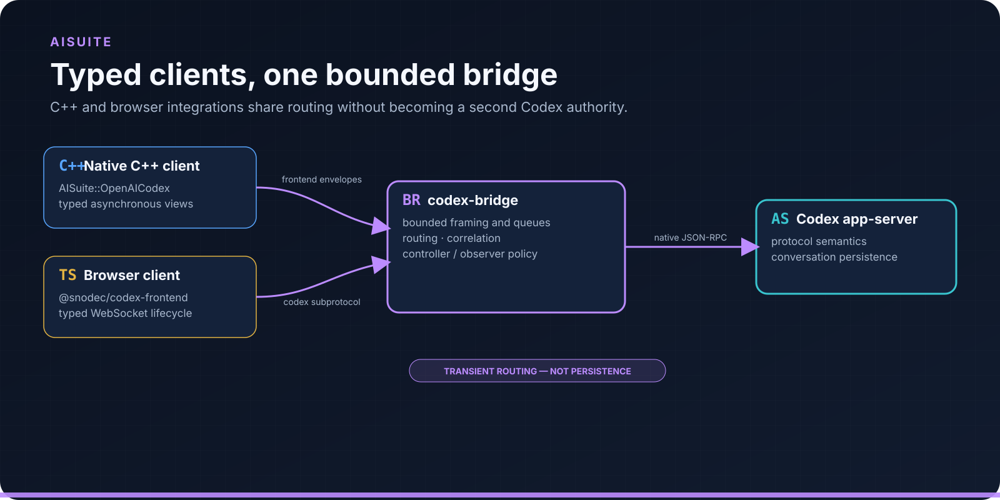
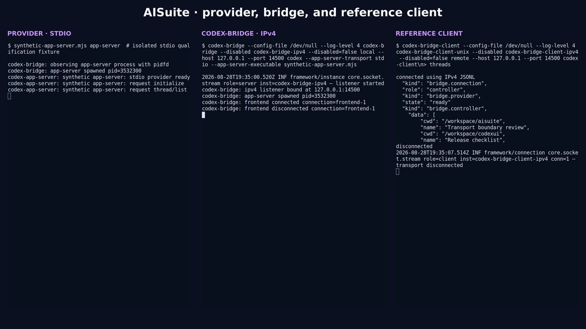
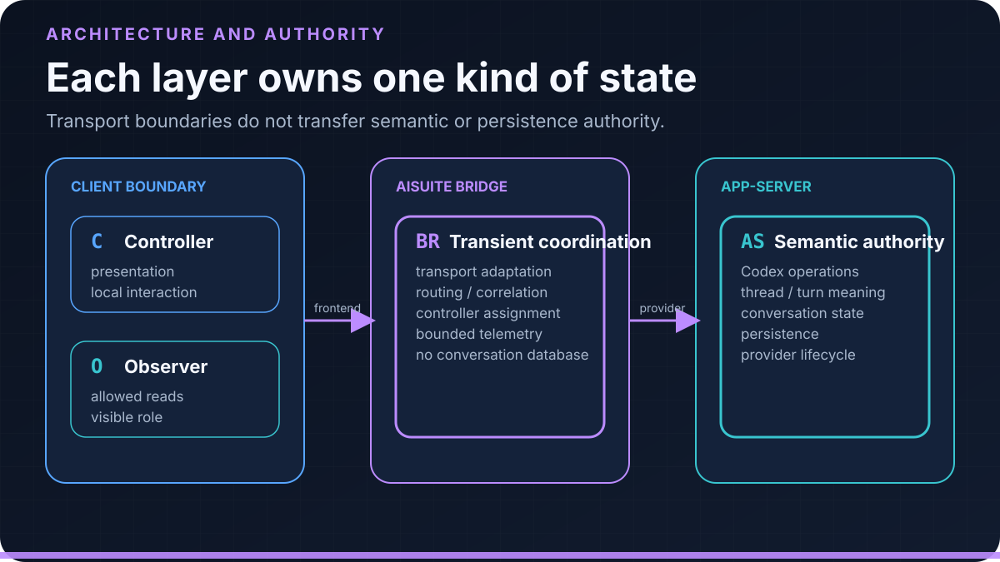
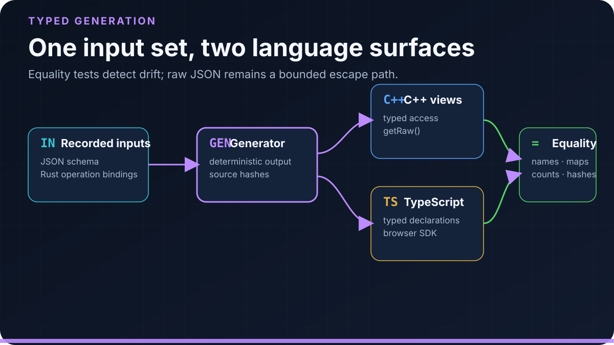

<div align="center">

# AISuite

### Typed C++ and TypeScript access with multi-client routing for the Codex app-server

Connect native and browser clients through one bounded bridge without making every
application implement raw JSON-RPC, correlation, and transport adaptation.

[Quick start](#quick-start) · [Transport model](#two-independent-transport-boundaries) ·
[Architecture](https://github.com/SNodeC/AISuite/blob/master/src/ai/openai/codex/docs/architecture.md) ·
[C++ source](https://github.com/SNodeC/AISuite/tree/master/src/ai/openai/codex)

</div>

> [!IMPORTANT]
> AISuite is an independent open-source project. It is not an official OpenAI
> SDK or product. Codex and the Codex app-server define the upstream protocol
> semantics; AISuite adapts and presents that protocol to its clients.



<sub>Figure: Typed clients share one bounded bridge while the app-server remains the semantic authority.</sub>

Current public `master` contains the C++20 implementation and a framework-neutral
TypeScript frontend SDK. The most recently qualified source was
[`c3cce28`](https://github.com/SNodeC/AISuite/commit/c3cce28d813b4f48376a2a0c6ac74131bf443f65),
whose CMake source version is `0.7.0`, built against SNode.C
[`bf01683`](https://github.com/SNodeC/snode.c/commit/bf01683a53b48220a840522e8ccaf3b48e58c240).
The TypeScript package manifest declares `@snodec/codex-frontend` `1.0.0`.
These are independent source-version surfaces, not conflicting versions of one
artifact. Neither a tagged AISuite release nor a public npm package was found
for this baseline.

## What AISuite provides

| Surface | Responsibility |
| --- | --- |
| `AISuite::OpenAICodex` | Installed CMake target for typed asynchronous C++ integration |
| `@snodec/codex-frontend` | Source package for typed browser clients and WebSocket lifecycle handling |
| Generated protocol views | Typed access to recorded protocol shapes while retaining lossless `getRaw()` JSON access |
| `codex-bridge` | Provider routing, controller/observer coordination, and optional static Web UI delivery |
| `codex-bridge-client` | Interactive reference client for inspection, safe reads, thread operations, and raw JSON-RPC escape-path evaluation |
| Acceptance tests | Deterministic and real-app-server coverage across provider and frontend transports |

The bridge does not become a second conversation database. The app-server owns
protocol meaning and persistence. AISuite owns transport adaptation, transient
routing/correlation state, controller assignment, and the explicitly bounded
telemetry described in its architecture contract.

## Quick start

### Install dependencies

These Debian/Ubuntu packages cover AISuite and the required base SNode.C build:

```sh
sudo apt update
sudo apt install --yes \
  build-essential ca-certificates cmake git ninja-build pkgconf \
  libssl-dev nlohmann-json3-dev
```

These packages are optional for the C++ build but required for the corresponding
qualified test, runtime, or TypeScript paths:

```sh
# Optional for the build; required for generated TLS test certificates.
sudo apt install --yes openssl

# Optional frontend transport: rebuild SNode.C with this package to expose
# AISuite's RFCOMM and RFCOMM-TLS instances.
sudo apt install --yes libbluetooth-dev

# Optional: Node/npm for the TypeScript frontend source package.
sudo apt install --yes npm
```

The lock file installs TypeScript `5.9.3` locally; no global TypeScript package
is required. Node/npm are not required to run the C++ bridge or to serve an
already built Web UI directory.

The Codex CLI is also optional at CMake configure time, but it is required for
the real-app-server tests and the interactive bridge run below. With a managed
Node/npm installation, install it in a user-writable prefix:

```sh
npm install --global --prefix "$HOME/.local" @openai/codex
export PATH="$HOME/.local/bin:$PATH"
codex --version
```

AISuite's CMake files do not discover Doxygen, IWYU, or source formatters, so
those are not AISuite dependencies. They remain optional maintainer tools in
the SNode.C and MQTTSuite builds that actually define those targets.

Build and install SNode.C first. Then build AISuite in a canonical reusable
directory and run its qualified transport suite:

```sh
git clone https://github.com/SNodeC/AISuite.git
cd AISuite

cmake -S . -B cmake-build-release -G Ninja \
  -DCMAKE_BUILD_TYPE=Release \
  -DCMAKE_PREFIX_PATH=/path/to/snode-install \
  -DCMAKE_INSTALL_PREFIX="$PWD/cmake-install-release" \
  -DAISUITE_BUILD_APPS=ON \
  -DAISUITE_BUILD_CODEX_TESTS=ON
cmake --build cmake-build-release --parallel
ctest --test-dir cmake-build-release --output-on-failure
cmake --install cmake-build-release
```

At the qualified commits, this runs 27 tests. They cover framing, typed frontend
access, routing, stdio provider behavior, stream and WebSocket frontend paths,
TLS/WSS frontend paths, Web UI path selection, and nine real-app-server
end-to-end cases. To qualify the optional TypeScript source package from the
same checkout:

```sh
npm ci --prefix packages/codex-frontend
npm test --prefix packages/codex-frontend
```

This separate command passes 20 TypeScript tests.

For an interactive local evaluation, ensure the `codex` executable is on
`PATH`, then start the bridge in terminal 1:

```sh
./cmake-build-release/src/apps/codex-bridge/codex-bridge \
  --log-level 4 \
  codex --app-server-transport stdio
```

The default provider mode launches and owns `codex app-server`; the default
frontend listener is a private runtime Unix-domain socket. In terminal 2:

```sh
./cmake-build-release/src/apps/codex-bridge-client/codex-bridge-client \
  --log-level 4 codex-client
```

After `connected using Unix JSONL`, enter `threads` for a harmless list request,
then `quit`. The result depends on the selected Codex home and authentication
state; an empty list is valid. Avoid using real prompts or credentials in
screenshots and logs.



<sub>Screenshot: Genuine terminals for the isolated stdio fixture, IPv4 bridge listener, controller state, and harmless thread-list response.</sub>

## Two independent transport boundaries

AISuite has two directions with different capabilities. They must not be merged
into one generic transport claim.

### 1. `codex-bridge` → Codex app-server

Select this boundary with the `codex` application option:

| Provider mode | Bridge argument | Ownership and wire path |
| --- | --- | --- |
| stdio | `codex --app-server-transport stdio` | Bridge launches `codex app-server`; JSONL over child stdin/stdout |
| Unix | `codex --app-server-transport unix` | Bridge connects to an independently started app-server WebSocket on the default Unix endpoint |
| IPv4 | `codex --app-server-transport websocket-ipv4` | Bridge connects to app-server WebSocket on `127.0.0.1:4501` by default |
| IPv6 | `codex --app-server-transport websocket-ipv6` | Bridge connects to app-server WebSocket on `[::1]:4501` by default |

External modes require an independently managed `codex app-server --listen`
endpoint matching the selected address. Current app-server listener evidence
contains `stdio://`, `unix://`, and `ws://` forms, not `wss://`. AISuite does
not claim provider-side TLS.

### 2. CodexUI/reference clients → `codex-bridge`

The bridge registers named listener instances. Unix is enabled by default;
other compiled instances are disabled until explicitly selected.

| Frontend listener | Bridge command fragment | Matching reference-client instance |
| --- | --- | --- |
| Unix stream | `codex-bridge` (default) | `codex-bridge-client-unix` (default) |
| IPv4 stream | `codex-bridge --disabled codex-bridge-ipv4 --disabled=false local --host 127.0.0.1 --port 4500` | `codex-bridge-client-ipv4 --disabled=false remote --host 127.0.0.1 --port 4500` |
| IPv6 stream | `codex-bridge --disabled codex-bridge-ipv6 --disabled=false local --host ::1 --port 4500` | `codex-bridge-client-ipv6 --disabled=false remote --host ::1 --port 4500` |
| WebSocket | enable `codex-bridge-websocket-ipv4` or `-ipv6` | enable the matching `codex-bridge-client-websocket-*` instance |
| TLS / WSS | enable the matching `tls-*` or `wss-*` listener | configure CA verification and client credentials on the matching client |

When selecting an alternative, disable the default Unix instance and enable
exactly one client instance. Use each binary's `--help=expanded` and
`--command-line=standard` output to confirm the effective address, path,
certificate, timeout, retry, and queue settings. TLS protects the transport; it
does not add application authentication or change controller authority.

## Architecture and authority

The first frontend can become controller when the default policy is enabled.
Additional frontends are observers; explicitly classified reads can be allowed
by policy. Mutating operations remain controller-governed. The bridge routes
responses and notifications but does not reinterpret app-server semantics.



<sub>Figure: AISuite owns transport and transient routing state, not conversation semantics or persistence.</sub>

All exposed boundaries are bounded: encoded message size, app-server input
queue, transport write queues, parser limits, retained diagnostics, and work per
event-loop pass. Bounds reduce uncontrolled resource growth; they are not a
complete security model.

## Typed protocol access

Generated C++ views and TypeScript declarations share recorded schema and
operation inputs. Cross-language tests check type names, bindings, required
parameters, counts, and source hashes. The C++ `getRaw()` surface preserves
original JSON outside a current view; raw JSON-RPC remains an escape hatch.



<sub>Figure: Shared inputs produce both language surfaces and equality evidence while raw JSON remains available.</sub>

The TypeScript `CodexBridgeClient`, `ClientConnection`, and
`WebSocketTransport` implement the browser-facing lifecycle. The transport uses
the `codex` subprotocol and does not reconnect automatically. The package is
buildable and packable from source but not published on the public npm registry.

With a WebSocket listener enabled, `codex-bridge` can serve a prebuilt Web UI at
`/` and upgrade `/codex`. `--bridge-web-root` overrides the install-derived
default; an empty value disables static delivery. AISuite does not build or
install the CodexWebUI artifact.

The manifest does not name a universal compatible Codex release. Re-run
generation and equality/acceptance tests whenever the upstream schema or Codex
CLI changes.

## Client integration lifecycle

A C++ consumer links `AISuite::OpenAICodex`; a browser consumer uses the
TypeScript SDK. Each selects a transport, registers typed handlers, and sends
after attachment. Admission, delivery, response, and notifications remain
distinct. Preserve correlation and unknown fields; discovery loss is not
deletion.

Design controller changes explicitly: observers may inspect allowed state, but
clients must expose whether they hold mutation authority. Test provider and
frontend loss, reconnect, duplicate or oversized requests, slow consumers, and
shutdown with outstanding work.

## Qualification and limits

The recorded launch build used Debian GNU/Linux forky/sid, x86-64, GCC 16.2.0,
CMake 4.3.4, Ninja 1.13.2, Node 24.19.0, npm 11.16.0, and the installed SNode.C
head above. All 27 configured C++ tests and all 20 TypeScript tests passed; both
C++ applications installed, and an npm package dry-run succeeded. This is
exact-revision evidence, not a broad platform, compatibility, publication, or
maturity claim.

Remote listener exposure needs an explicit trust design. AISuite does not add a
bearer-token authentication layer to the frontend protocol. Bind addresses,
TLS verification, network access controls, Codex credentials, logs, and process
ownership must be reviewed together.

## Troubleshooting and evaluation hygiene

- For runtime-socket failure, check directory ownership and permissions; do not
  move the listener to a public bind as a workaround.
- For stdio failure, run `codex` directly and verify the selected Codex home.
- For provider WebSocket failure, match `--listen` and the selected address
  family; provider-side WSS is absent.
- For denied mutation, inspect controller/observer events. Sanitize retained
  JSON output and logs.

## Project routes

- Read the complete [architecture contract](https://github.com/SNodeC/AISuite/blob/master/src/ai/openai/codex/docs/architecture.md).
- Inspect [Issues](https://github.com/SNodeC/AISuite/issues) and
  [releases](https://github.com/SNodeC/AISuite/releases).
- Use [CodexUI](https://github.com/SNodeC/CodexUI) as the native/browser visual client.
- Review the dual-license terms: `MIT OR LGPL-3.0-or-later`.

Dedicated public security, support, and contribution policy files are not yet
present. Do not publish credentials, private prompts, conversation data, or
remote endpoint details in an issue.
