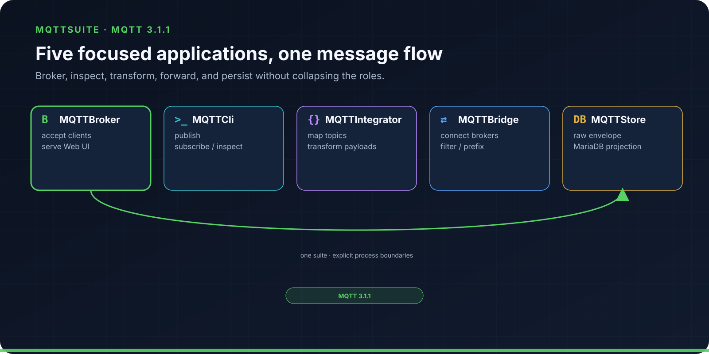
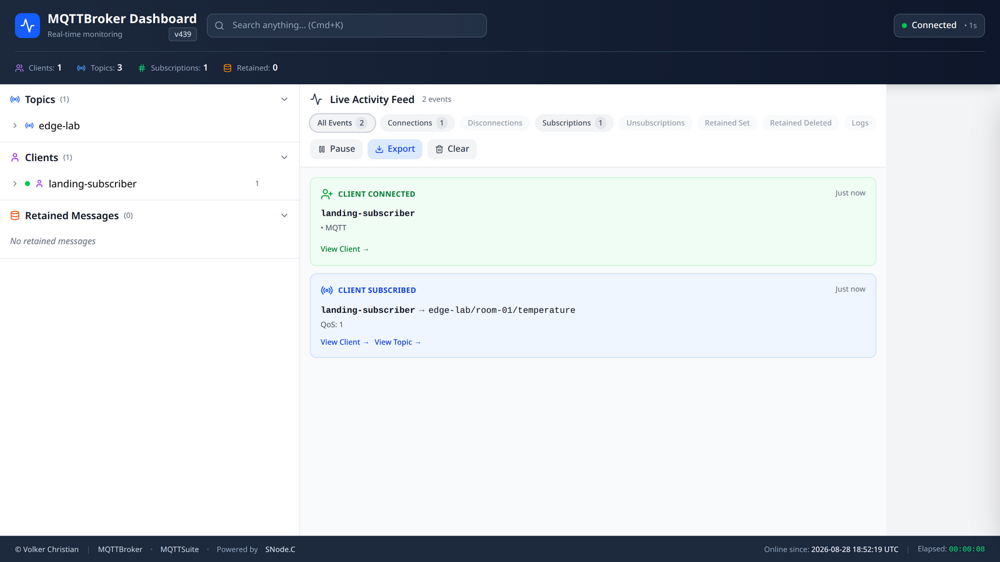
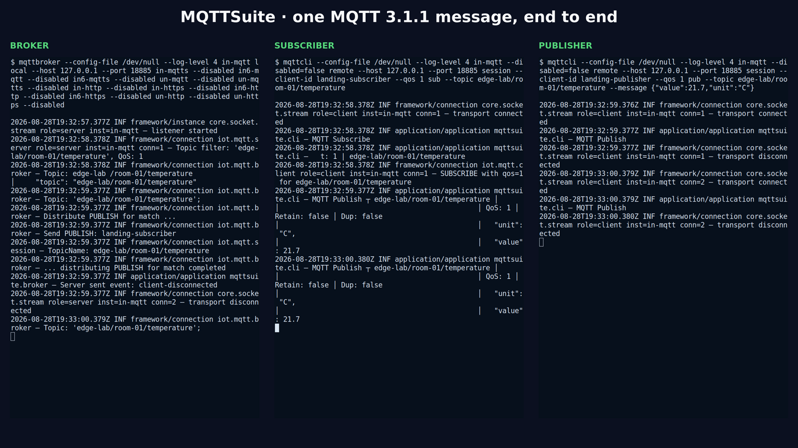
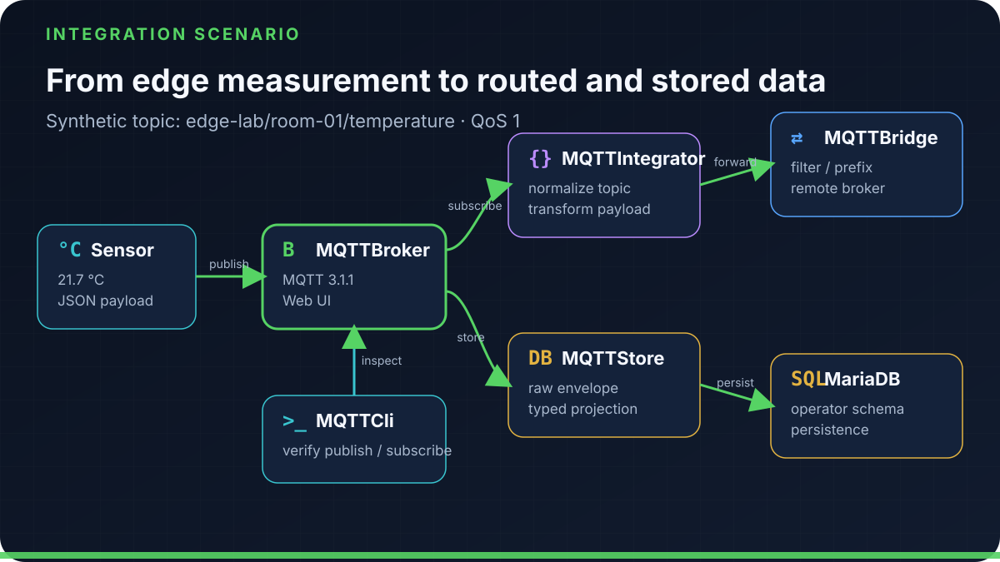

<div align="center">

# MQTTSuite

### Five focused applications for MQTT 3.1.1 systems

Accept device connections, inspect traffic, transform messages, connect
brokers, and persist selected data with one SNode.C-based toolkit.

[Quick start](#quick-start) · [Applications](#five-applications-one-toolkit) ·
[Integration flow](#from-device-message-to-integration-flow) ·
[API documentation](https://snodec.github.io/mqttsuite-doc/html/index.html)

</div>



<sub>Figure: Broker, CLI, integration, bridge, and storage roles remain independently runnable.</sub>

> [!NOTE]
> This page tracks current public `master`. The last qualified source was
> [`52de563`](https://github.com/SNodeC/mqttsuite/commit/52de5631245c6318bfa5b7cca700f0754014f34d),
> built against SNode.C
> [`bf01683`](https://github.com/SNodeC/snode.c/commit/bf01683a53b48220a840522e8ccaf3b48e58c240).
> CMake declares source version `1.0.1`; current master is newer than the tag
> with that name, so the number alone does not identify the tested release.

## Five applications, one toolkit

MQTTSuite separates operational roles into independently runnable programs.
Use one application or compose several around your MQTT deployment.

| Application | Use it to | Primary boundary |
| --- | --- | --- |
| **MQTTBroker** · `mqttbroker` | Accept MQTT 3.1.1 connections and expose the bundled browser UI | Broker sessions, subscriptions, publications, and optional HTTP surface |
| **MQTTCli** · `mqttcli` | Publish, subscribe, and inspect message flows from a terminal | One selected MQTT client transport and session |
| **MQTTIntegrator** · `mqttintegrator` | Transform topics and payloads with configured mappings | Subscribed input → mapping → republished output |
| **MQTTBridge** · `mqttbridge` | Forward selected traffic among configured broker connections | Outbound broker clients grouped into logical bridges |
| **MQTTStore** · `mqttstore` | Persist raw MQTT envelopes and configured projections | MQTT subscription → MariaDB storage plan |

The applications share SNode.C's configuration model, but they remain separate
processes. MQTTSuite is not one monolithic daemon, and MQTTBroker alone is not
the complete suite.



<sub>Figure: Real current-master broker Web UI populated by the synthetic `edge-lab` qualification scenario.</sub>

## Quick start

This local scenario starts one IPv4 broker listener, subscribes to a synthetic
sensor topic, and publishes one JSON measurement at QoS 1.

### Install dependencies

These Debian/Ubuntu packages cover MQTTSuite's complete default build. The
MariaDB development package is required because MQTTStore requests SNode.C's
`db-mariadb` component:

```sh
sudo apt update
sudo apt install --yes \
  build-essential ca-certificates cmake git ninja-build \
  nlohmann-json3-dev libmariadb-dev
```

Build and install [SNode.C](https://github.com/SNodeC/snode.c) first with its
required packages. Its install must contain the MQTT, HTTP/Express, WebSocket,
TLS, and MariaDB components requested by MQTTSuite's default options. The
following packages are optional for MQTTSuite itself:

```sh
# Optional transports/runtime tools: rebuild SNode.C with Bluetooth support
# before enabling MQTTSuite's RFCOMM/L2CAP targets; libmagic improves HTTP
# MIME detection; openssl supports TLS setup.
sudo apt install --yes libbluetooth-dev libmagic-dev openssl

# Optional maintainer tools discovered by MQTTSuite's CMake files.
sudo apt install --yes \
  doxygen graphviz iwyu clang-format cmake-format jsbeautifier npm

# Optional CSS formatter; installs `prettier` without writing into system paths.
npm install --global --prefix "$HOME/.local" prettier
export PATH="$HOME/.local/bin:$PATH"
```

Doxygen and Graphviz build the API documentation and its diagrams; IWYU checks
include usage; the remaining tools feed the `format` target. None is required
to build or run the broker/CLI scenario. MQTTSuite uses a recursive
`json-schema-validator` submodule, so clone it explicitly.

```sh
git clone --recurse-submodules https://github.com/SNodeC/mqttsuite.git
cd mqttsuite

cmake -S . -B cmake-build-release -G Ninja \
  -DCMAKE_BUILD_TYPE=Release \
  -DCMAKE_PREFIX_PATH=/path/to/snode-install \
  -DCMAKE_INSTALL_PREFIX="$PWD/cmake-install-release" \
  -DCHECK_INCLUDES=OFF
cmake --build cmake-build-release --parallel
```

In terminal 1, enable only the listener used by the demo:

```sh
./cmake-build-release/mqttbroker/mqttbroker --config-file /dev/null --log-level 4 \
  in-mqtt local --host 127.0.0.1 --port 18885 \
  in-mqtts --disabled \
  in6-mqtt --disabled \
  in6-mqtts --disabled \
  un-mqtt --disabled \
  un-mqtts --disabled \
  in-http --disabled \
  in-https --disabled \
  in6-http --disabled \
  in6-https --disabled \
  un-http --disabled \
  un-https --disabled
```

In terminal 2, subscribe:

```sh
./cmake-build-release/mqttcli/mqttcli --config-file /dev/null --log-level 4 \
  in-mqtt --disabled=false remote --host 127.0.0.1 --port 18885 \
  session --client-id landing-subscriber --qos 1 \
  sub --topic edge-lab/room-01/temperature
```

In terminal 3, publish:

```sh
./cmake-build-release/mqttcli/mqttcli --config-file /dev/null --log-level 4 \
  in-mqtt --disabled=false remote --host 127.0.0.1 --port 18885 \
  session --client-id landing-publisher --qos 1 \
  pub --topic edge-lab/room-01/temperature \
      --message '{"value":21.7,"unit":"C"}'
```

The subscriber prints the topic, parsed JSON body, `QoS: 1`, and
`Retain: false`. Stop the publisher after its first publication if its socket
policy reconnects, then stop the subscriber and broker with
<kbd>Ctrl</kbd>+<kbd>C</kbd>. These commands were run verbatim against the
commits above on Debian GNU/Linux forky/sid, x86-64, GCC 16.2.0.



<sub>Screenshot: Genuine terminals from one local MQTT 3.1.1 QoS 1 publication delivered to the subscriber.</sub>

### Transport and session variations

MQTTCli selects one named client instance. MQTTBroker exposes corresponding
server instances. Use `--help=expanded` on an executable before changing a
deployment configuration.

| Evaluation change | Broker instance | Client instance and setting |
| --- | --- | --- |
| IPv6 stream | `in6-mqtt local --host ::1 --port 18884` | `in6-mqtt --disabled=false remote --host ::1 --port 18884` |
| Unix-domain stream | `un-mqtt local --sun-path /tmp/mqttsuite.sock` | `un-mqtt --disabled=false remote --sun-path /tmp/mqttsuite.sock` |
| TLS over IPv4 | `in-mqtts` with server certificate, key, and CA options | `in-mqtts --disabled=false` with client certificate/key and CA verification |
| MQTT over WebSocket | Enable a broker HTTP/WebSocket listener | Select `in-wsmqtt`, `in6-wsmqtt`, or the corresponding secure instance |
| Retained QoS 1 value | unchanged | add `pub --retain` while keeping `session --qos 1` |

Only the principal IPv4 message flow above is the public first-success proof.
TLS, WebSocket, retained-session, and address-family combinations must be
qualified for the exact application role and certificate/session policy before
deployment.

## From device message to integration flow



<sub>Figure: A complete evaluation topology; each application remains an independently qualified responsibility.</sub>

This is a composition model, not an assertion that all five applications must
run together. The landing-page scenario uses the stable synthetic topic
`edge-lab/room-01/temperature`; mapping definitions, bridge graphs, and storage
plans belong in their focused guides rather than one oversized startup command.

## Capabilities and limits

| Area | Current-master implementation | Public boundary |
| --- | --- | --- |
| MQTT | MQTT protocol level 4, corresponding to MQTT 3.1.1 | Do not read this as MQTT 5 support or a complete conformance claim |
| Broker | Multiple address/stream instances, session store option, HTTP assets | Authentication, TLS policy, persistence, and exposure are operator decisions |
| Mapping | Static, scalar-template, and JSON-template mapping sources/schemas | A schema option is not proof of a particular production transformation |
| Bridging | Configured broker groups, filters/prefixes, sessions, loop-related controls | Cyclic topology safety requires a topology-specific test |
| Storage | Raw envelope and configured MariaDB projection implementation | Schema lifecycle, retention, migration, and failure recovery remain operator-owned |
| Deployment | CMake build/install and SNode.C component dependencies | No broad distribution, ARM, Android, or OpenWrt support statement is made here |

Current master has no MQTTSuite test directory or application build/test CI
job. For launch qualification, all five executables compiled and the broker/CLI
message path ran successfully. That evidence does not extend to unexecuted
mapping, multi-broker, Web UI, or database scenarios.

## Qualify the next application

Expand from the quick start one responsibility at a time. Keep the same
synthetic topic and payload so the new behavior is the only changing variable.

1. Add MQTTIntegrator with one reviewed mapping and prove both the subscribed
   input and republished normalized output.
2. Add one remote test broker to MQTTBridge, then verify topic filters,
   prefixes, session settings, and loop controls in both directions.
3. Add MQTTStore to a disposable MariaDB schema. Capture the raw envelope and
   one typed projection, then test malformed input, database loss, restart, and
   retention ownership.
4. Enable MQTTBroker's HTTP surface only after fixing its bind address and
   exposure policy. Populate the Web UI with synthetic clients and topics
   before capturing launch imagery.

For every step, record the exact executable, selected transport instance,
configuration file, dependency versions, observed input/output, teardown, and
failure case. A successful broker/CLI publication does not prove mapping,
forwarding, database, or browser behavior.

## Operational questions to answer

Before moving from evaluation to a maintained deployment, decide who owns
certificates and rotation, credentials, session persistence, mapping reviews,
bridge topology, database migrations, retention, monitoring, upgrades, and
rollback. Set explicit frame/message and queue limits for the workload. Test
offline peers and malformed payloads rather than assuming reconnect or schema
options cover every failure.

MQTT 3.1.1 features such as QoS, wills, retained messages, persistent sessions,
wildcards, and credentials interact. Document the exact combinations you use;
do not turn protocol-level source support into a blanket conformance or
production-readiness statement.

## Build, configure, and extend

Keep a reusable `cmake-build-release` for the same SHA, generator, compiler,
SNode.C prefix, submodule revision, and CMake options. Reconfigure when any of
those inputs changes. Use `--show-config` to inspect effective values,
`--command-line=standard` to reproduce non-default settings, and
`--help=expanded` to explore an application's named instances and sections.

Detailed mapping, bridge, storage, and API material is available in the
[generated documentation](https://snodec.github.io/mqttsuite-doc/html/index.html)
and the repository's [`docs`](https://github.com/SNodeC/mqttsuite/tree/master/docs)
and application directories.

## Project routes

- Browse the [repository](https://github.com/SNodeC/mqttsuite) and
  [releases](https://github.com/SNodeC/mqttsuite/releases).
- Report reproducible defects in [Issues](https://github.com/SNodeC/mqttsuite/issues).
- Review the license expression `MIT OR GPL-3.0-or-later`. The SPDX expression
  and included full license texts are authoritative; do not copy the stale
  LGPL wording found in one prose license sentence.

Dedicated public security, support, and contribution policy files are not yet
present. Avoid sending sensitive deployment details, credentials, certificates,
or database contents through a public issue.
