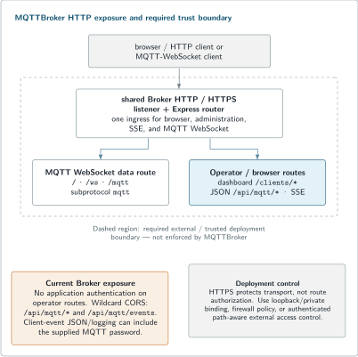

# MQTTBroker HTTP and event administration

MQTTBroker bundles a browser dashboard and exposes HTTP operations plus Server-Sent Events (SSE) for broker state. This page documents the external contract visible in [`mqttbroker/mqttbroker.cpp`](https://github.com/SNodeC/mqttsuite/blob/52de5631245c6318bfa5b7cca700f0754014f34d/mqttbroker/mqttbroker.cpp) and [`mqttbroker/lib/MqttModel.cpp`](https://github.com/SNodeC/mqttsuite/blob/52de5631245c6318bfa5b7cca700f0754014f34d/mqttbroker/lib/MqttModel.cpp) at `SNodeC/mqttsuite@52de5631245c6318bfa5b7cca700f0754014f34d`.

The bundled dashboard is a real product surface. The trust model of the current HTTP API is also important: **current main does not apply application-level authentication to these Broker administration or event routes.**

## Trust boundary first

Treat the Broker dashboard, `/api/mqtt/*`, `/api/mqtt/events`, and legacy `/sse` as **trusted operational surfaces**.

Current implementation characteristics:

- no Basic/Bearer/session authentication middleware is applied to the Broker routes described below;
- `/api/mqtt` responses get `Access-Control-Allow-Origin: *`;
- `/api/mqtt/events` also emits wildcard CORS;
- mutating routes can disconnect clients, change subscriptions, and release retained state;
- client event JSON includes supplied MQTT username and password fields;
- live connect/disconnect event JSON is also written through the Broker information log path;
- MQTT CONNECT username/password fields do not establish a broker credential-verification backend in the reviewed source.

Therefore do **not** expose the current administration/event surface to an untrusted network merely because the listener uses HTTPS. TLS protects traffic in transit; it is not route authorization.

Practical deployment controls can include loopback/private binding, firewall policy, an authenticated reverse proxy, or another network boundary appropriate to the environment. If MQTT clients use credentials, assume current Broker event/log visibility is credential-sensitive.

<picture>
  <source media="(max-width: 600px)" srcset="../assets/broker-trust-boundary-mobile.svg">
  
</picture>

<sub>The current Broker administration/event surface belongs inside a trusted operator boundary; TLS alone does not authorize callers.</sub>

## Dashboard relationship

The Broker installs its dashboard assets below the configured Web root and redirects:

```text
/        -> /clients      when not upgrading to WebSocket
/clients -> /clients/index.html
```

The `/clients` static tree is served by the Broker process. The dashboard consumes the event stream and the administration routes documented here.

The WebSocket MQTT upgrade is a separate protocol path. Requests to `/`, `/ws`, or `/mqtt` that carry a WebSocket upgrade can be upgraded when the requested `Sec-WebSocket-Protocol` includes `mqtt`.

## Administration routes

All request bodies below are JSON.

### Disconnect a client

```http
POST /api/mqtt/disconnect
Content-Type: application/json

{"clientId":"sensor-gateway-01"}
```

If the client exists, the Broker closes its socket connection and returns a success JSON object:

```json
{"success":true,"message":"Client disconnected successfully"}
```

Unknown client:

```text
HTTP 404
{"success":false,"error":"Client not found"}
```

If the JSON attribute cannot be obtained with the expected type, the route returns HTTP 400 with a plain-text `Attribute type not found: ...` message.

### Remove a subscription from a connected client

```http
POST /api/mqtt/unsubscribe
Content-Type: application/json

{"clientId":"sensor-gateway-01","topic":"sensors/+/debug"}
```

Success:

```json
{"success":true,"message":"Client unsubscribed successfully"}
```

Unknown client returns HTTP 404; attribute/type extraction failure returns HTTP 400.

This operation changes Broker-side subscription state for the selected connected client. It is not an MQTT command sent to an arbitrary remote management agent.

### Add a subscription for a connected client

```http
POST /api/mqtt/subscribe
Content-Type: application/json

{"clientId":"sensor-gateway-01","topic":"commands/device-01/#","qos":1}
```

Success:

```json
{"success":true,"message":"Client subscribed successfully"}
```

Unknown client returns HTTP 404; attribute/type extraction failure returns HTTP 400.

`qos` is parsed as an unsigned 8-bit value by this route. This page does not claim additional route-level validation beyond what the source performs.

### Release a retained message

```http
POST /api/mqtt/release
Content-Type: application/json

{"topic":"devices/device-01/state"}
```

The Broker publishes an empty retained value for the selected topic and updates its Broker model. Success response:

```json
{"success":true,"message":"Retained message released successfully"}
```

Attribute/type extraction failure returns HTTP 400.

This is the dashboard/API operation for deleting/releasing retained state; it is not a general publish endpoint.

## CORS behavior

The `/api/mqtt` JSON router currently sets:

```text
Access-Control-Allow-Origin: *
Access-Control-Allow-Headers: Content-Type
Access-Control-Allow-Methods: GET, OPTIONS, POST
Access-Control-Allow-Private-Network: true
```

`GET /api/mqtt/events` also sets:

```text
Access-Control-Allow-Origin: *
```

There is no current MQTTSuite Broker option on this path for an origin allow-list. If cross-origin exposure is not intended, enforce the desired boundary outside the application or constrain listener reachability.

## SSE event streams

Two routes attach receivers to the same `MqttModel` event source:

```text
GET /api/mqtt/events
GET /sse
```

A request is treated as SSE when its `Accept` header contains `text/event-stream`. Otherwise:

- `/api/mqtt/events` redirects to `/clients`;
- `/sse` redirects to `/clients`.

The primary `/api/mqtt/events` response sets:

```text
Content-Type: text/event-stream
Cache-Control: no-cache
Connection: keep-alive
Access-Control-Allow-Origin: *
```

The legacy `/sse` route sets the SSE content/cache/connection headers without the API route's explicit wildcard-CORS header.

## Initial state replay

When a receiver is attached, `MqttModel::addEventReceiver()` sends a current-state snapshot before live changes. The snapshot consists of:

1. `ui-initialize`;
2. one `client-connected` event for each currently connected client;
3. `client-subscribed` events for current subscriptions;
4. `retained-message-set` events for current retained messages.

This is **current-state replay**, not replay of an event backlog.

## Event vocabulary

Current event names are:

| Event | Meaning |
| --- | --- |
| `ui-initialize` | dashboard/model initialization marker |
| `client-connected` | client became visible in Broker model, or initial snapshot of an existing client |
| `client-disconnected` | client left Broker model |
| `client-subscribed` | subscription added/current subscription replayed |
| `client-unsubscribed` | subscription removed |
| `retained-message-set` | retained state set/current retained replayed |
| `retained-message-deleted` | retained state removed |

The event ID is generated by the model and sent with SSE data. The model also writes a keep-alive comment periodically (current code uses a 39-second timer).

## Client event payload

The current client serializer includes operational/session fields such as:

```text
clientId
connection
cleanSession
username / usernameFlag
password / passwordFlag
keepAlive
protocol
level
loopPrevention
willTopic / willMessage / willQoS / willRetain
online duration
remote/address information
```

The exact object is intended for the bundled dashboard, but it is externally observable on the event stream.

### Credential warning

At this revision, the serialized object contains the supplied MQTT `password` value, not only `passwordFlag`. Live client events using this representation can also be written to Broker logs.

Do not treat `/api/mqtt/events`, `/sse`, or unredacted Broker logs as safe public telemetry when clients use credentials.

## Subscription and retained-message payloads

Subscription events carry the client identity and topic/QoS state used by the dashboard. Retained-message events carry the topic plus retained payload/QoS state maintained by the model.

Because these are operational representations, the API should not be treated as a generic stable MQTT-management standard. It is the current MQTTSuite dashboard/admin contract and can expose deployment-sensitive topic/client data.

## `Last-Event-ID`

Both SSE routes pass the incoming `Last-Event-ID` header to `MqttModel::addEventReceiver()`. Current implementation marks that argument unused and does **not** use it to replay a missed-event history.

What reconnecting clients get is the current snapshot described above followed by new live events.

Do not promise resumable event-log replay based on SSE `Last-Event-ID` at this revision.

## Error and response behavior

The administration routes return application JSON for normal success and “client not found” cases, while JSON attribute/type extraction errors use HTTP 400 plain text.

The implementation directly indexes fields from the parsed JSON object. This reference documents the expected request shapes, not a comprehensive hardened validation/error schema for arbitrary malformed bodies.

For operational automation:

- send `Content-Type: application/json`;
- check both HTTP status and response body;
- treat 404 as “selected client no longer exists” for client-specific operations;
- treat 400 as malformed/missing/incorrectly typed request data;
- avoid assuming an unspecified error body is JSON.

## What state is exposed

The HTTP/SSE surface is oriented toward the bundled dashboard. It exposes enough state to inspect connected clients, subscriptions and retained messages and to mutate the selected administrative operations.

It does **not** constitute a complete broker-management API specification. This documentation does not claim endpoints for:

- creating broker users/ACLs;
- querying a durable event history;
- administering MQTT authentication policy;
- changing every MQTT session field;
- arbitrary MQTT publishing through the HTTP API;
- transactionally coordinating multiple administration operations.

## MQTT WebSocket contract

MQTT-over-WebSocket uses the same Broker HTTP server infrastructure but a different route behavior. The current upgrade path:

1. checks that `Sec-WebSocket-Protocol` contains `mqtt`;
2. upgrades on `/`, `/ws`, or `/mqtt` when an Upgrade request is present;
3. rejects unsupported/missing MQTT subprotocol selection with HTTP 404.

MQTT-over-WebSocket is therefore not the same as the dashboard SSE channel.

## Example: watch the event stream

On a deliberately trusted local deployment:

```bash
curl -N \
  -H 'Accept: text/event-stream' \
  http://127.0.0.1:8080/api/mqtt/events
```

Before using this against a credential-bearing Broker, remember that current client event payloads can include MQTT passwords.

## Example: disconnect a test client

```bash
curl \
  -H 'Content-Type: application/json' \
  -d '{"clientId":"landing-subscriber"}' \
  http://127.0.0.1:8080/api/mqtt/disconnect
```

Use only against an intentionally trusted test/admin listener.

## Evidence boundary

**Exercised:** the real Broker dashboard and Broker/CLI MQTT message path were runtime-qualified by the documentation workflow.

**Source-verified:** the route definitions, response bodies/status cases, SSE snapshot/event behavior, current CORS policy and client serializer.

**Not separately exercised by this documentation pass:** every mutating admin route, cross-origin browser behavior, TLS variants, long-running SSE reconnection, or an adversarial malformed-request matrix.

## Source anchors

- [Broker route tree](https://github.com/SNodeC/mqttsuite/blob/52de5631245c6318bfa5b7cca700f0754014f34d/mqttbroker/mqttbroker.cpp)
- [Broker model/events](https://github.com/SNodeC/mqttsuite/blob/52de5631245c6318bfa5b7cca700f0754014f34d/mqttbroker/lib/MqttModel.cpp)
- [Broker MQTT behavior](https://github.com/SNodeC/mqttsuite/blob/52de5631245c6318bfa5b7cca700f0754014f34d/mqttbroker/lib/Mqtt.cpp)
