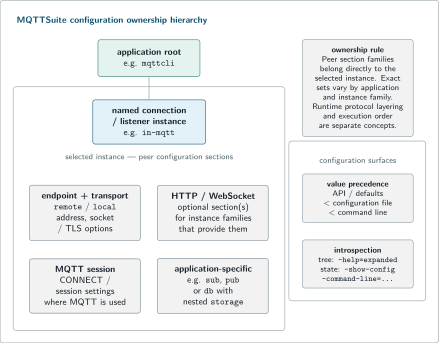

# MQTTSuite configuration reference

MQTTSuite applications inherit SNode.C's hierarchical configuration system and add MQTT- and application-specific sections. This page documents the operating model that matters to MQTTSuite users. For the full framework-level configuration surface, see the [SNode.C configuration reference](https://github.com/SNodeC/SNode.C-Landingpages/blob/7c19c74865d02c320cfedae7326b2e96b0eddb14/SNode.C/docs/configuration.md).

## Configuration hierarchy

The command line mirrors the configuration tree. A typical client command is:

```text
mqttcli
  in-mqtt
    remote --host 127.0.0.1 --port 1883
    session --client-id inspector --qos 1
    sub --topic sensors/#
```

Read this as:

1. `mqttcli` — application root;
2. `in-mqtt` — named connection instance;
3. `remote` — peer address for that instance;
4. `session` — MQTT CONNECT/session behavior;
5. `sub` — application action after the MQTT session is established.

Server applications use analogous `local` address sections. WebSocket clients add an HTTP section. MQTTStore adds `db` and nested `storage`; MQTTBroker and MQTTIntegrator add application options; MQTTBridge builds its outbound client instances from a separate bridge-definition document.

<picture>
  <source media="(max-width: 600px)" srcset="../assets/mqttsuite-configuration-hierarchy-mobile.svg">
  
</picture>

<sub>The application command tree and persisted configuration describe the same named-instance hierarchy.</sub>

## Values and precedence

SNode.C supplies configurable values from three layers:

```text
API / compiled defaults
        < configuration file
        < command line
```

A command-line value therefore overrides the corresponding configuration-file value, and a configuration-file value overrides an API/default value.

The `-c` / `--config-file` option accepts more than one file. When deliberately layering files with overlapping values, use `--show-config` to inspect the effective result rather than assuming a particular merge pattern.

For isolated experiments, `--config-file /dev/null` avoids inheriting ordinary persisted settings.

## Named instances

A connection instance is an independently configurable endpoint inside one process. Typical MQTTSuite client instances, when compiled in, include:

```text
in-mqtt       in-mqtts
in6-mqtt      in6-mqtts
un-mqtt       un-mqtts
in-wsmqtt     in-wsmqtts
in6-wsmqtt    in6-wsmqtts
un-wsmqtt     un-wsmqtts
```

MQTTCli and MQTTStore create their client instances disabled; enable the one you intend to use with `--disabled=false`. MQTTIntegrator starts its configured clients as part of application startup. MQTTBridge differs: its outbound clients are materialized from the bridge-definition document.

MQTTBroker exposes server instances for direct MQTT and HTTP/HTTPS listener roles.

### Client-side remote-port defaults

Do not infer a client default from a server convention or from the `mqtts` suffix. Current client defaults are:

| Client instance family | Stack | Source default remote port |
| --- | --- | ---: |
| `in-mqtt`, `in6-mqtt` | direct MQTT over plain stream | `1883` |
| `in-mqtts`, `in6-mqtts` | direct MQTT over TLS stream | **`1883`** |
| `in-wsmqtt`, `in6-wsmqtt` | MQTT over WebSocket | `8080` |
| `in-wsmqtts`, `in6-wsmqtts` | MQTT over secure WebSocket | `8088` |

The non-obvious point is the TLS-client default: **`in-mqtts` and `in6-mqtts` default to remote port `1883`, not `8883`.** If the target broker listens for MQTT/TLS on `8883`, set `remote --port 8883` explicitly.

Unix-domain client instances do not use a TCP port. MQTTBridge member addresses come from each member's `network` object instead of these ordinary client-instance defaults.

### HTTP/admin instance names are application-local

Instance names are local to each executable:

| Application | Instance | Role | Source default |
| --- | --- | --- | ---: |
| MQTTBroker | `in-http` | dashboard/admin/SSE/WebSocket HTTP | `8080` |
| MQTTBroker | `in-https` | dashboard/admin/SSE/WebSocket HTTPS | `8088` |
| MQTTIntegrator | `in-http` | mapping administration HTTP | `8085` |
| MQTTIntegrator | `in-https` | mapping administration HTTPS | `8086` |
| MQTTBridge | `admin-legacy` | bridge administration HTTP/SSE | `8081` |
| MQTTBridge | `admin-tls` | bridge administration HTTPS/SSE | `8082` |

So `in-http` in a Broker command and `in-http` in an Integrator command are different listeners owned by different applications.

## Inspect before you run

Useful SNode.C inspection modes include:

```bash
<application> --help=expanded
<application> --show-config
<application> --command-line=standard
<application> --command-line=active
<application> --command-line=complete
<application> --command-line=required
```

Use `--help=expanded` to discover the compiled command tree and `--show-config` / `--command-line=active` to inspect the effective state before persisting it.

## Persist a known-good configuration

`-w` / `--write-config` writes configurable state and exits. A practical workflow is:

1. make an explicit command work;
2. inspect the effective state;
3. persist it;
4. review the saved file, including credentials;
5. start the application from that file.

Example:

```bash
mqttcli \
  --config-file /dev/null \
  in-mqtt --disabled=false \
    remote --host 127.0.0.1 --port 1883 \
    session --client-id inspector --qos 1 \
    sub --topic sensors/# \
  --write-config ./mqttcli.conf
```

Then:

```bash
mqttcli --config-file ./mqttcli.conf
```

Configuration files can contain MQTT, database, TLS, or other credentials. Treat them as secret-bearing operational files.

## MQTT session sections

MQTTCli and MQTTStore expose explicit `session` sections with the usual MQTT CONNECT/session concepts:

- client ID;
- default QoS (`0..2`);
- keepalive;
- persistent-session selection (`--retain-session`, which sets `clean_session=false`);
- will topic, message, QoS, and retain flag;
- username and password;
- local session-store path where the application exposes one.

MQTTIntegrator obtains analogous session values from its mapping document. MQTTBridge stores them per broker member in its bridge definition.

MQTT username/password fields are CONNECT inputs. Whether they authenticate or authorize a connection depends on the broker.

## Subscription QoS versus publish QoS

Keep the two meanings separate:

- **subscription QoS** asks the broker for a maximum delivery QoS for a topic filter;
- **publish QoS** is the QoS used for an outgoing PUBLISH.

MQTTCli and MQTTStore use a default session QoS and allow a per-topic override with the `##<qos>` suffix. For example:

```text
sensors/+/temperature##1
alerts/###2
```

The second value means MQTT filter `alerts/#` with requested subscription QoS 2. MQTTCli uses the same suffix convention on its publish topic to override publish QoS for that publication.

<picture>
  <source media="(max-width: 600px)" srcset="../assets/subscription-vs-publish-qos-mobile.svg">
  
</picture>

<sub>Subscription QoS limits requested delivery; publish QoS independently selects the outgoing PUBLISH service level.</sub>

## Direct MQTT and MQTT over WebSocket

Direct MQTT client paths are built on SNode.C stream/TLS connections. WebSocket paths insert HTTP and a WebSocket upgrade before the MQTT `mqtt` subprotocol.

MQTTCli and MQTTStore expose an HTTP `--target` for WebSocket clients and default it to `/ws`. MQTTIntegrator and MQTTBridge use `/ws`. MQTTBroker accepts the MQTT WebSocket subprotocol on `/ws`, `/mqtt`, and `/`.

TLS protects transport. It does not by itself add MQTT authorization or HTTP administration authorization.

## Retry and reconnect

MQTTSuite client applications use SNode.C retry/reconnect behavior. Operationally this means:

- long-lived subscribers can recover from connection loss;
- Integrator, Bridge and Store can reconnect to configured broker endpoints;
- a CLI publish-only connection can reconnect after completing a publish, so stop an interactive one-shot publisher after the first verified result when repetition is not desired.

Persistent MQTT session behavior is separate from transport reconnect. Use a stable client ID, persistent-session configuration, and a session-store option where the application exposes one and the workflow requires state across process restarts.

## TLS configuration

TLS options live in the selected SNode.C connection instance. Inspect the exact certificate, CA, verification, and socket options with:

```bash
<application> <instance> --help=expanded
```

Do not treat an `mqtts`, `https`, or `wsmqtts` instance name as proof that application authorization has been configured.

## Logging and diagnostics

MQTTSuite uses SNode.C logging, including semantic filters. For targeted troubleshooting, a useful pattern is:

```bash
mqttcli \
  --log-level info \
  --log-instance-level=in-mqtt=debug \
  ...
```

Use verbose logging carefully. Current MQTTSuite source contains secret-bearing debug paths, including plaintext credential logging in some applications and Broker event/log representations that can contain a supplied MQTT password.

For the complete logging option set and semantic-filter precedence, use the [SNode.C configuration reference](https://github.com/SNodeC/SNode.C-Landingpages/blob/7c19c74865d02c320cfedae7326b2e96b0eddb14/SNode.C/docs/configuration.md).

## Domain configuration files

Do not confuse SNode.C application configuration with the domain documents used by individual MQTTSuite applications:

| Document | Application | Purpose |
| --- | --- | --- |
| mapping JSON | MQTTIntegrator; optional Broker mapper | subscribe/match/transform/republish behavior |
| bridge-definition JSON | MQTTBridge | logical bridges, broker members, subscriptions, prefixes and MQTT sessions |
| projection JSON | MQTTStore | optional extraction of topic/JSON values into typed MariaDB tables |

Those documents have separate schemas and lifecycles:

- [MQTTIntegrator mapping reference](integrator-mapping.md)
- [MQTTBridge definition reference](bridge-definition.md)
- [MQTTStore storage reference](store-storage.md)

## Capability and evidence boundary

This page describes the configuration surfaces available in the reviewed source. Runtime qualification does not cover every address-family × TLS × WebSocket × application combination. See [Capabilities and evidence](capabilities.md) for that boundary.

## Source anchors

- [SNode.C `SubCommand.cpp`](https://github.com/SNodeC/snode.c/blob/5d6453c21df4894083b445cce00b627e7794932a/src/utils/SubCommand.cpp)
- [SNode.C `Config.cpp`](https://github.com/SNodeC/snode.c/blob/5d6453c21df4894083b445cce00b627e7794932a/src/utils/Config.cpp)
- [MQTTSuite `ConfigApplication.cpp`](https://github.com/SNodeC/mqttsuite/blob/6c0ff62c612694a6111ff971c446327938130cf0/lib/ConfigApplication.cpp)
- [MQTTCli configuration sections](https://github.com/SNodeC/mqttsuite/blob/6c0ff62c612694a6111ff971c446327938130cf0/mqttcli/lib/ConfigSections.cpp)
- [MQTTStore configuration sections](https://github.com/SNodeC/mqttsuite/blob/6c0ff62c612694a6111ff971c446327938130cf0/mqttstore/lib/ConfigSections.cpp)
