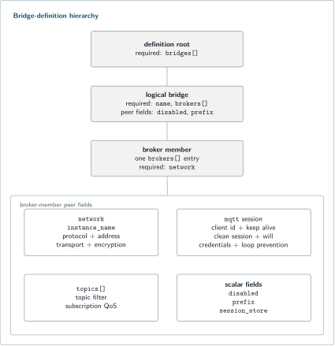
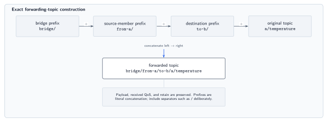
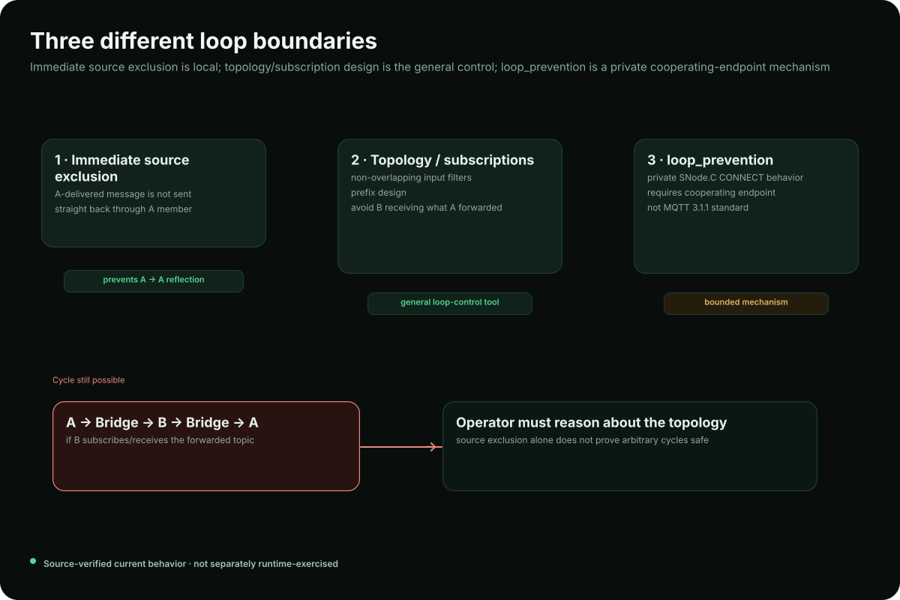

# MQTTBridge

MQTTBridge is the MQTTSuite client-side broker interconnection application. It creates one or more logical bridges, connects each logical bridge to multiple MQTT brokers as clients, subscribes to configured input filters, and forwards received publishes to the other connected members.

MQTTBridge is not an MQTT broker and it is not MQTTIntegrator. It forwards payloads unchanged and can prepend configured topic prefixes; Integrator can transform both topic and payload.

The suite build and shared configuration model are in the [MQTTSuite README](../README.md). This README owns bridge definitions, forwarding, prefixing, loop boundaries, and the application-level admin summary. Detailed HTTP/SSE contracts are in [Bridge HTTP API and SSE](../docs/bridge-http-api.md).

## Quick Start: bridge two local brokers

Assume two brokers listen on:

```text
Broker A: 127.0.0.1:18831
Broker B: 127.0.0.1:18832
```

Create `bridge.json`:

```json
{
  "bridges": [
    {
      "name": "lab",
      "brokers": [
        {
          "network": {
            "instance_name": "broker-a",
            "protocol": "in",
            "encryption": "legacy",
            "transport": "stream",
            "in": { "host": "127.0.0.1", "port": 18831 }
          },
          "mqtt": {
            "client_id": "bridge-a",
            "clean_session": true,
            "loop_prevention": false
          },
          "topics": [ { "topic": "a/#", "qos": 1 } ]
        },
        {
          "network": {
            "instance_name": "broker-b",
            "protocol": "in",
            "encryption": "legacy",
            "transport": "stream",
            "in": { "host": "127.0.0.1", "port": 18832 }
          },
          "mqtt": {
            "client_id": "bridge-b",
            "clean_session": true,
            "loop_prevention": false
          },
          "topics": [ { "topic": "b/#", "qos": 1 } ]
        }
      ]
    }
  ]
}
```

Start the bridge. `--definition` belongs to the required `bridge` subcommand:

```bash
mqttbridge \
  --config-file /dev/null \
  bridge --definition ./bridge.json \
  admin-legacy --disabled \
  admin-tls --disabled
```

The input filters deliberately do not overlap. A message received from A on `a/#` is forwarded to B; B subscribes only to `b/#`, so the forwarded `a/#` message does not immediately re-enter through the B member.

Subscribe on Broker B:

```bash
mqttcli \
  --config-file /dev/null \
  in-mqtt --disabled=false \
    remote --host 127.0.0.1 --port 18832 \
    session --client-id bridge-observer --qos 1 \
    sub --topic 'a/#'
```

Publish on Broker A:

```bash
mqttcli \
  --config-file /dev/null \
  in-mqtt --disabled=false \
    remote --host 127.0.0.1 --port 18831 \
    session --client-id bridge-source --qos 1 \
    pub --topic a/temperature \
        --message '{"value":21.7,"unit":"C"}'
```

The B observer should receive the same topic, payload, QoS, and retain state.

## Bridge or Integrator?

| MQTTBridge | MQTTIntegrator |
| --- | --- |
| connects multiple broker members | connects as a transformation client |
| subscribes selected input filters | subscribes mapping-derived filters |
| forwards payload unchanged | can transform payload |
| can prepend configured prefixes | can render arbitrary mapped topics |
| preserves received QoS/retain | output QoS/retain are mapping decisions |
| no `MqttMapper` | built around `MqttMapper` |

Use Bridge when selected MQTT traffic should cross broker domains. Use Integrator when the message contract itself should change.

## Architecture

A bridge-definition document is validated and turned into logical bridges and broker members. Each member becomes an outbound SNode.C MQTT client. On CONNACK it subscribes to its configured filters; on PUBLISH it hands the message to its owning logical bridge for forwarding.

<picture>
  <source media="(max-width: 600px)" srcset="../assets/bridge-definition-runtime-mobile.svg">
  
</picture>

<sub>The bridge definition becomes logical bridge/member objects and then concrete outbound MQTT clients.</sub>

A complete installation places `mqttbridge` in `${CMAKE_INSTALL_PREFIX}/bin` and Web assets under `${CMAKE_INSTALL_PREFIX}/var/www/mqttsuite/mqttbridge`.

Use `bridge --html-dir` to point the runtime at the installed Web assets when needed:

```bash
mqttbridge \
  bridge \
    --definition ./bridge.json \
    --html-dir /usr/local/var/www/mqttsuite/mqttbridge
```

## Bridge-definition structure

MQTTBridge requires:

```text
bridge --definition <file>
```

The current schema is [`lib/bridge-schema.json`](lib/bridge-schema.json).

At the top level:

```json
{
  "bridges": [
    {
      "name": "lab",
      "disabled": false,
      "prefix": "",
      "brokers": []
    }
  ]
}
```

Each logical bridge has a name, optional disabled flag/prefix, and one or more broker members. A broker member can contain:

- `disabled`;
- `session_store`;
- `network`;
- `mqtt` session settings;
- member `prefix`;
- `topics` subscriptions.

<picture>
  <source media="(max-width: 600px)" srcset="../assets/bridge-definition-hierarchy-mobile.svg">
  
</picture>

<sub>Bridge-wide and broker-member settings have separate scopes in the definition document.</sub>

### Network

IPv4/IPv6 stream members use a protocol-specific address object containing host/port. `encryption` selects the plain (`legacy`) or TLS stack; `transport` selects direct stream or WebSocket.

Example:

```json
{
  "network": {
    "instance_name": "remote-a",
    "protocol": "in",
    "encryption": "legacy",
    "transport": "stream",
    "in": {
      "host": "192.0.2.10",
      "port": 1883
    }
  }
}
```

### MQTT session

A member's `mqtt` object can configure client ID, keep-alive, clean-session state, will, username/password, and `loop_prevention`. These values are sent by MQTTBridge as an MQTT client; they do not define the remote broker's access policy.

### Persistent session store

`session_store` is a per-member local path for persistent MQTT client session state. Use a stable path with appropriate ownership when session persistence is required.

### Subscriptions

Each member's `topics` array selects input filters and subscription QoS:

```json
"topics": [
  { "topic": "sensors/+/temperature", "qos": 1 },
  { "topic": "alerts/#", "qos": 2 }
]
```

These filters control what the member receives from its broker. They do not filter which bridge messages may be published to that member as a destination.

## Prefix construction

The forwarded topic is constructed as:

```text
bridge prefix
+ source-member prefix
+ destination-member prefix
+ original MQTT topic
```

For:

```text
bridge prefix:      bridge/
source prefix:      from-a/
destination prefix: to-b/
original topic:     a/temperature
```

Broker B receives:

```text
bridge/from-a/to-b/a/temperature
```

Prefixes are literal concatenation; include separators such as `/` deliberately. Payload, QoS, and retain are preserved.

<picture>
  <source media="(max-width: 600px)" srcset="../assets/bridge-prefix-construction-mobile.svg">
  
</picture>

<sub>Prefixes are literal concatenation; delimiters such as `/` must be included deliberately.</sub>

## Multi-member forwarding and loops

For a message received from A in a three-member bridge, Bridge forwards to B and C and excludes A from that forwarding pass.

Immediate source exclusion does not by itself prevent a later cycle such as:

```text
A -> B -> A
```

Subscription partitioning and prefix design remain important topology tools. The complete [three-broker example](../docs/bridge-multi-broker-example.md) shows a non-overlapping three-member design.

The definition also exposes:

```json
"loop_prevention": true
```

This requests a private SNode.C origin-reflection mechanism. It is not a standard MQTT 3.1.1 loop-prevention feature and does not prove arbitrary cyclic topologies safe, especially when third-party brokers or additional bridges are involved.

<picture>
  <source media="(max-width: 600px)" srcset="../assets/bridge-loop-boundaries-mobile.svg">
  
</picture>

<sub>Immediate source exclusion is local; topology design remains the general loop-control mechanism.</sub>

## Transport boundaries

Current runtime paths cover IPv4/IPv6 stream and WebSocket members with plain/TLS variants where built. WebSocket clients request `/ws` with subprotocol `mqtt`.

Two source/schema boundaries matter when choosing other tokens:

- the schema's direct Unix-domain address shape and the current direct-stream runtime lookup do not agree, so direct Unix-domain Bridge deployment is not presented as a working path here;
- the schema admits `rc` and `l2`, but the current Bridge runtime has no corresponding member-instantiation branches.

Treat these as unavailable Bridge choices in this revision rather than inferring support from schema vocabulary alone.

## Administration

MQTTBridge creates two IPv4 administration listeners:

```text
admin-legacy   8081
admin-tls      8082
```

They can be disabled through normal instance configuration.

The administration surface provides active configuration read-back, JSON Patch updates, restart/apply behavior, SSE status events, and Web assets when an HTML directory is configured.

```text
GET   /api/bridge/config
PATCH /api/bridge/config
GET   /api/bridge/sse
```

For exact request/response bodies, persistence/restart behavior, event vocabulary, replay behavior, and trust boundaries, see [Bridge HTTP API and SSE](../docs/bridge-http-api.md).

## Persisting application configuration

The bridge definition remains its own JSON document. The SNode.C application configuration can persist the path and runtime options:

```bash
mqttbridge \
  --config-file /dev/null \
  bridge \
    --definition /etc/mqttsuite/bridge.json \
    --html-dir /usr/local/var/www/mqttsuite/mqttbridge \
  admin-legacy --disabled \
  admin-tls --disabled \
  --write-config ./mqttbridge.conf
```

Then:

```bash
mqttbridge --config-file ./mqttbridge.conf
```

## Trust and exposure boundaries

- Bridge definitions can contain broker credentials.
- Current debug logging can expose broker username/password values.
- The HTTP/SSE administration surface has no application authentication in the current implementation.
- `GET /api/bridge/config` can return the full active definition, including credentials.
- PATCH changes live operational configuration and can restart broker-member clients.
- TLS protects transport but does not add application authorization.

Keep the administration listeners and definition files inside a trusted operational boundary.

## Troubleshooting

### `bridge --definition` is rejected

The definition option is required and the path must exist. Validate JSON against [`lib/bridge-schema.json`](lib/bridge-schema.json).

### A member never connects

Check `disabled`, network protocol/transport/encryption values, host/port, MQTT credentials/session values, and whether the selected transport is one of the runtime paths described above.

### Messages loop

Reduce the topology to two members, use non-overlapping input filters, inspect prefixes, then add members back one at a time. Do not rely on `loop_prevention` as a substitute for topology design.

### Web configuration is unavailable

Check the admin listener, `bridge --html-dir`, and that the installed Web assets exist at the configured path.

## Related documentation

- [MQTTSuite overview and build](../README.md)
- [Bridge definition routing page](../docs/bridge-definition.md)
- [Complete three-broker example](../docs/bridge-multi-broker-example.md)
- [Bridge HTTP API and SSE](../docs/bridge-http-api.md)
- [MQTTBroker](../mqttbroker/README.md)
- [MQTTIntegrator](../mqttintegrator/README.md)
- [MQTTCli](../mqttcli/README.md)
- [MQTTStore](../mqttstore/README.md)

## License

MQTTSuite is available under:

```text
MIT OR GPL-3.0-or-later
```
