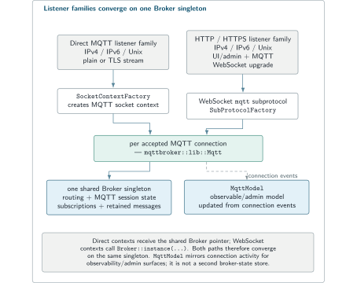
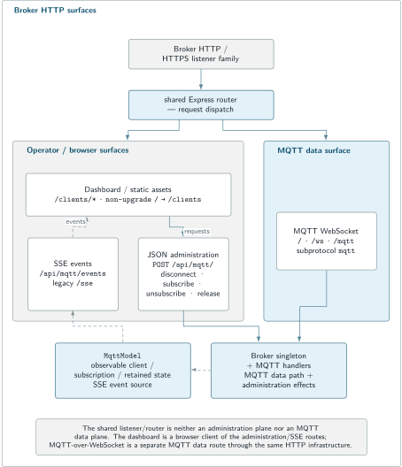
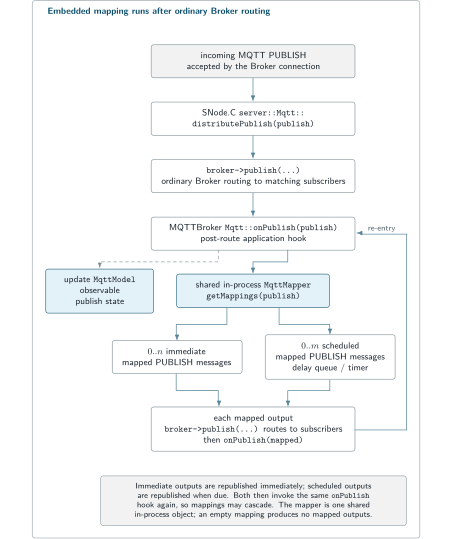

# MQTTBroker

MQTTBroker is the MQTTSuite MQTT 3.1.1 server application. It accepts MQTT client connections, owns shared broker/session state through SNode.C, exposes the bundled dashboard and operational HTTP/SSE routes, and can optionally run the shared mapper in-process.

Use MQTTBroker for the server role. Use [MQTTIntegrator](../mqttintegrator/README.md) for a separate transformation service, [MQTTBridge](../mqttbridge/README.md) for broker-domain forwarding, [MQTTCli](../mqttcli/README.md) for inspection, and [MQTTStore](../mqttstore/README.md) for persistence.

The suite build and shared configuration model are in the [MQTTSuite README](../README.md). Exact HTTP/SSE contracts are in [Broker HTTP API and SSE](../docs/broker-http-api.md).

## Quick Start

Start one isolated plain MQTT/IPv4 listener on `127.0.0.1:18885` and disable the other built-in listener/Web instances:

```bash
mqttbroker \
  --config-file /dev/null \
  --log-level 5 \
  in-mqtt local --host 127.0.0.1 --port 18885 \
  in-mqtts --disabled \
  in6-mqtt --disabled \
  in6-mqtts --disabled \
  un-mqtt --disabled \
  un-mqtts --disabled \
  in-http --disabled \
  in-https --disabled \
  in6-http --disabled \
  in6-https --disabled \
  un-http --disabled \
  un-https --disabled
```

Subscribe from another terminal:

```bash
mqttcli \
  --config-file /dev/null \
  in-mqtt --disabled=false \
    remote --host 127.0.0.1 --port 18885 \
    session --client-id broker-check-sub --qos 1 \
    sub --topic edge-lab/room-01/temperature
```

Publish from a third:

```bash
mqttcli \
  --config-file /dev/null \
  in-mqtt --disabled=false \
    remote --host 127.0.0.1 --port 18885 \
    session --client-id broker-check-pub --qos 1 \
    pub --topic edge-lab/room-01/temperature \
        --message '{"value":21.7,"unit":"C"}'
```

The subscriber should show the topic, QoS 1, retain/dup flags, and JSON payload. Stop a manual one-shot publisher after the first verified result if its reconnecting client path starts again.

## Architecture

Each enabled SNode.C server endpoint creates a per-connection MQTT context around the same Broker core. Direct MQTT listeners and MQTT-over-WebSocket clients therefore participate in one shared session/subscription/retained-message state.

MQTTSuite adds the application-visible `MqttModel` used by the dashboard/event stream and can invoke the shared `MqttMapper` for optional in-process transformation.

<picture>
  <source media="(max-width: 600px)" srcset="../assets/broker-listener-families-mobile.svg">
  
</picture>

<sub>Enabled listener families create connection-local MQTT contexts around one shared Broker state.</sub>

## Build and install

`mqttbroker` is built by the repository's top-level CMake project. A complete installation places the executable in `${CMAKE_INSTALL_PREFIX}/bin` and the Broker Web assets under:

```text
${CMAKE_INSTALL_PREFIX}/var/www/mqttsuite/mqttbroker
```

See [Build and install](../README.md#build-and-install) for the full suite command sequence.

## MQTT listener instances

When the corresponding build options are enabled, MQTTBroker provides:

| Instance | Transport | Source default |
| --- | --- | --- |
| `in-mqtt` | plain IPv4 stream | `1883` |
| `in-mqtts` | TLS over IPv4 stream | `8883` |
| `in6-mqtt` | plain IPv6 stream | `1883`, IPv6-only |
| `in6-mqtts` | TLS over IPv6 stream | `8883`, IPv6-only |
| `un-mqtt` | plain Unix-domain stream | application/instance socket path |
| `un-mqtts` | TLS over Unix-domain stream | application/instance socket path |

Configure listener addresses under the instance's `local` section:

```bash
mqttbroker in-mqtt local --host 0.0.0.0 --port 1883
```

For a stable Unix-domain listener:

```bash
mqttbroker un-mqtt local --sun-path /run/mqttsuite/broker.sock
```

Use expanded help for the selected TLS instance when configuring certificate/trust settings:

```bash
mqttbroker in-mqtts --help=expanded
```

TLS changes transport protection. It does not add MQTT authorization by itself.

## Broker state and persistence

The shared Broker core owns connected clients, subscriptions, retained messages, session state, and publish routing.

For broker-side session persistence, configure:

```bash
mqttbroker \
  broker --mqtt-session-store /var/lib/mqttsuite/mqttbroker-session.json \
  in-mqtt local --host 127.0.0.1 --port 1883
```

Once an explicit command is correct, persist the application configuration with `--write-config` and start from the resulting file. Protect session/config files according to the state or credentials they contain.

## Dashboard, HTTP operations, and MQTT over WebSocket

MQTTBroker also creates HTTP/HTTPS server instances:

| Instance | Stack | Source default |
| --- | --- | --- |
| `in-http` | HTTP over IPv4 | `8080` |
| `in-https` | HTTPS over IPv4 | `8088` |
| `in6-http` | HTTP over IPv6 | `8080`, IPv6-only |
| `in6-https` | HTTPS over IPv6 | `8088`, IPv6-only |
| `un-http` | HTTP over Unix-domain stream | application/instance path |
| `un-https` | HTTPS over Unix-domain stream | application/instance path |

These listeners serve three related roles:

1. the Broker dashboard below `/clients`;
2. JSON/SSE operational routes;
3. MQTT WebSocket upgrades.

MQTT WebSocket clients normally use `/ws` with subprotocol `mqtt`. A local check with MQTTCli looks like:

```bash
mqttcli \
  --config-file /dev/null \
  in-wsmqtt --disabled=false \
    remote --host 127.0.0.1 --port 8080 \
    http --target /ws \
    session --client-id broker-ws-check --qos 1 \
    sub --topic edge-lab/#
```

The dashboard receives live updates through SSE. Current operational routes include:

```text
GET  /api/mqtt/events
GET  /sse
POST /api/mqtt/disconnect
POST /api/mqtt/unsubscribe
POST /api/mqtt/release
POST /api/mqtt/subscribe
```

For exact bodies, status behavior, CORS, SSE event vocabulary, snapshot/replay behavior, and credential exposure, use [Broker HTTP API and SSE](../docs/broker-http-api.md).

<picture>
  <source media="(max-width: 600px)" srcset="../assets/broker-http-surfaces-mobile.svg">
  
</picture>

<sub>The Broker HTTP listener family carries four distinct contracts; MQTT-over-WebSocket is part of the MQTT data plane, not the dashboard event stream.</sub>

## Optional embedded mapping

MQTTBroker and MQTTIntegrator use the same `MqttMapper` implementation.

```bash
mqttbroker \
  broker --mqtt-mapping-file ./mapping.json \
  in-mqtt local --host 127.0.0.1 --port 1883
```

With a mapper configured, incoming publishes can produce zero or more mapped publishes that are routed back through the same Broker. Immediate and delayed outputs use the mapper's normal semantics; there is no child `mqttintegrator` process.

Use embedded mapping for a compact Broker-owned deployment. Use standalone [MQTTIntegrator](../mqttintegrator/README.md) when transformation should have its own MQTT connection and administration lifecycle.

<picture>
  <source media="(max-width: 600px)" srcset="../assets/broker-embedded-mapper-mobile.svg">
  
</picture>

<sub>Embedded mapping reuses the shared mapper inside MQTTBroker; mapped outputs return to the same Broker core.</sub>

The mapping grammar is documented in [Integrator mapping](../docs/integrator-mapping.md).

## Trust and exposure boundaries

- MQTT CONNECT username/password fields are protocol inputs; the current Broker layer does not establish a general credential-verification/authorization backend from them.
- The dashboard/admin/SSE surface has no application-level authentication in the current implementation.
- The operational API is not merely read-only; it can disconnect clients, change subscriptions, and release retained state.
- Event/log representations can contain supplied MQTT password material.
- TLS protects transport but does not decide which MQTT client or HTTP operator is authorized.
- Session-store, mapping, and saved configuration files may contain sensitive operational state.

Bind administrative HTTP access to a trusted interface or place it behind deployment-specific network/access controls.

## Troubleshooting

### Listener does not start

Check the selected instance, bind address, port/socket availability, directory permissions for Unix sockets, and TLS files/options for encrypted instances. Use `--help=expanded` on the failing instance.

### Client connects but receives no messages

Verify the subscriber filter, publisher topic, QoS expectations, retained-state expectations, and that both clients are connected to the intended Broker process. MQTTCli is the simplest independent check.

### Dashboard is unavailable

Check that the intended HTTP/HTTPS instance is enabled and reachable, that `broker --html-root` points to the installed Broker Web directory, and that `/clients/index.html` exists there.

### Mapping output is missing

First verify the original publication reaches normal subscribers, then validate the mapping against [`../lib/mapping-schema.json`](../lib/mapping-schema.json) and follow the [Integrator mapping](../docs/integrator-mapping.md) troubleshooting path.

## Related documentation

- [MQTTSuite overview and build](../README.md)
- [Broker HTTP API and SSE](../docs/broker-http-api.md)
- [MQTTIntegrator](../mqttintegrator/README.md)
- [MQTTBridge](../mqttbridge/README.md)
- [MQTTCli](../mqttcli/README.md)
- [MQTTStore](../mqttstore/README.md)
- [SNode.C](https://github.com/SNodeC/snode.c)

## License

MQTTSuite is available under:

```text
MIT OR GPL-3.0-or-later
```
