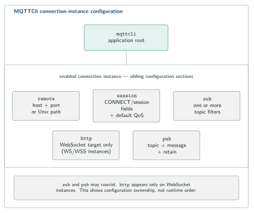

# MQTTCli

MQTTCli is the MQTTSuite command-line MQTT 3.1.1 client. It can subscribe, publish, or do both on one connection, and it is the fastest way to verify MQTTBroker, MQTTIntegrator, MQTTBridge, and MQTTStore without introducing another client implementation.

Use `mqttcli` when you want to answer concrete questions such as:

- Can I connect to this broker endpoint?
- Does this subscription receive the expected topic and QoS?
- Did MQTTIntegrator produce the mapped output?
- Did MQTTBridge forward the message to the other broker?
- Did MQTTStore receive the test event I am about to query in MariaDB?

The suite-level build and shared SNode.C configuration model are in the [MQTTSuite README](../README.md). This README focuses on commands and observable behavior.

## Quick Start

Subscribe:

```bash
mqttcli \
  --config-file /dev/null \
  in-mqtt --disabled=false \
    remote --host 127.0.0.1 --port 1883 \
    session --client-id cli-subscriber --qos 1 \
    sub --topic edge-lab/room-01/temperature
```

Publish from another terminal:

```bash
mqttcli \
  --config-file /dev/null \
  in-mqtt --disabled=false \
    remote --host 127.0.0.1 --port 1883 \
    session --client-id cli-publisher --qos 1 \
    pub --topic edge-lab/room-01/temperature \
        --message '{"value":21.7,"unit":"C"}'
```

Received publishes are printed with topic, QoS, retain, duplicate flag, and payload. JSON payloads are pretty-printed.

MQTTCli client endpoints reconnect. For a manual one-shot publish, stop the publisher with `Ctrl-C` after the first verified result when repetition is not desired.

## Command anatomy

A normal invocation follows the SNode.C hierarchy:

```text
mqttcli
  <connection-instance>
    remote ...
    http ...          # WebSocket connections only
    session ...
    sub ...
    pub ...
```

Example:

```bash
mqttcli \
  in-wsmqtt --disabled=false \
    remote --host 127.0.0.1 --port 8080 \
    http --target /ws \
    session --client-id browser-path-check --qos 1 \
    sub --topic 'demo/#'
```

Use expanded help to inspect the options compiled into the current installation:

```bash
mqttcli --help=expanded
mqttcli in-mqtt --help=expanded
mqttcli in-mqtt session --help=expanded
```

<picture>
  <source media="(max-width: 600px)" srcset="../assets/mqttcli-command-hierarchy-mobile.svg">
  
</picture>

<sub>One selected connection instance owns its transport, MQTT session, and optional subscribe/publish actions.</sub>

## Connection instances

When compiled in, MQTTCli creates:

```text
in-mqtt       in-mqtts
in6-mqtt      in6-mqtts
un-mqtt       un-mqtts
in-wsmqtt     in-wsmqtts
in6-wsmqtt    in6-wsmqtts
un-wsmqtt     un-wsmqtts
```

These instances are created disabled. Enable the one you want with:

```text
--disabled=false
```

The shared [configuration reference](../docs/configuration.md) documents the client-side default ports and common instance behavior.

## Session settings

The `session` subcommand controls MQTT CONNECT/session behavior. Current application options include:

```text
--client-id <string>
--qos <0..2>
--retain-session
--keep-alive <seconds>
--will-topic <topic>
--will-message <message>
--will-qos <qos>
--will-retain
--username <string>
--password <string>
```

### Client ID and persistent session

Use a stable unique client ID when you need a persistent MQTT session. `--retain-session` sets `clean_session=false` and requires a client ID.

```text
--retain-session=false   -> clean_session=true
--retain-session=true    -> clean_session=false
```

MQTTCli does not expose the persistent session-store path option used by Integrator/Store.

### Default QoS

`session --qos` is the default QoS used for publications and subscriptions unless a topic-specific override is supplied.

```bash
session --qos 1
```

### Username and password

```bash
session --username alice --password 'example-secret'
```

These values are sent in MQTT CONNECT. Whether they authenticate or authorize anything depends on the broker.

### Last Will

```bash
session \
  --client-id monitored-client \
  --will-topic clients/monitored-client/status \
  --will-message offline \
  --will-qos 1 \
  --will-retain
```

The will is intended for unexpected connection loss; a clean shutdown that sends DISCONNECT is not a will-delivery test.

## Subscribing

### One topic filter

```bash
mqttcli \
  in-mqtt --disabled=false \
    remote --host 127.0.0.1 --port 1883 \
    session --client-id sub-one --qos 0 \
    sub --topic sensors/room-01/temperature
```

### Wildcards

```bash
sub --topic 'sensors/+/temperature'
```

or:

```bash
sub --topic 'sensors/#'
```

Quote wildcard-containing filters in shell commands.

### Multiple topics

```bash
sub \
  --topic 'sensors/+/temperature' \
  --topic 'alerts/#' \
  --topic system/status
```

### Per-topic QoS override

MQTTCli accepts:

```text
<topic-filter>##<qos>
```

For example:

```bash
session --qos 0 \
sub \
  --topic 'sensors/+/temperature##1' \
  --topic 'alerts/###2'
```

The second string is parsed as filter `alerts/#` with QoS override `2`.

## Publishing

### Text publish

```bash
mqttcli \
  in-mqtt --disabled=false \
    remote --host 127.0.0.1 --port 1883 \
    session --client-id pub-text --qos 0 \
    pub --topic demo/state --message online
```

### Per-publish QoS override

`pub --topic` accepts the same suffix convention:

```text
<topic>##<qos>
```

Example: keep the session default at QoS 0 but send one publication at QoS 2:

```bash
mqttcli \
  in-mqtt --disabled=false \
    remote --host 127.0.0.1 --port 1883 \
    session --client-id pub-override --qos 0 \
    pub --topic 'demo/value##2' --message 42
```

The broker receives topic `demo/value` at QoS 2.

For publish-only operation, QoS 0 disconnects after sending; QoS 1 waits for PUBACK; QoS 2 waits for the QoS 2 completion path before requesting disconnect.

### JSON publish

```bash
pub \
  --topic normalized/room-01/temperature \
  --message '{"value":21.7,"unit":"C"}'
```

MQTTCli does not assign semantic meaning to the JSON; pretty-printing occurs only when receiving a payload that parses successfully.

### Retained publish

```bash
mqttcli \
  in-mqtt --disabled=false \
    remote --host 127.0.0.1 --port 1883 \
    session --client-id pub-retained --qos 1 \
    pub --topic devices/pump-1/status \
        --message online \
        --retain
```

A newly connected subscriber should receive the retained state according to broker behavior.

## Subscribe and publish on one connection

If both `sub` and `pub` are present, MQTTCli subscribes and publishes on the same MQTT connection:

```bash
mqttcli \
  in-mqtt --disabled=false \
    remote --host 127.0.0.1 --port 1883 \
    session --client-id pubsub-demo --qos 1 \
    sub --topic 'demo/replies/#' \
    pub --topic demo/request --message ping
```

Because a subscription is active, the client remains connected to receive matching messages.

## Transport examples

The MQTT behavior stays the same; choose a different connection instance and address/HTTP section.

### IPv4

```bash
in-mqtt --disabled=false \
  remote --host 127.0.0.1 --port 1883
```

### IPv6

```bash
in6-mqtt --disabled=false \
  remote --host ::1 --port 1883
```

### TLS

```bash
in-mqtts --disabled=false \
  remote --host broker.example.net --port 8883
```

Configure the instance's SNode.C TLS section for the required CA/certificate/key verification. The source default remote port for `in-mqtts` is `1883`; `8883` is set explicitly here because it is a common broker-side TLS listener convention.

### MQTT over WebSocket

```bash
mqttcli \
  in-wsmqtt --disabled=false \
    remote --host 127.0.0.1 --port 8080 \
    http --target /ws \
    session --client-id ws-check --qos 1 \
    sub --topic 'demo/#'
```

The WebSocket client requests subprotocol `mqtt`. `http --target` defaults to `/ws`.

### WSS

```bash
mqttcli \
  in-wsmqtts --disabled=false \
    remote --host broker.example.net --port 8088 \
    http --target /ws \
    session --client-id wss-check --qos 1 \
    sub --topic 'demo/#'
```

### Unix-domain MQTT

```bash
mqttcli \
  un-mqtt --disabled=false \
    remote --sun-path /run/mqttsuite/broker.sock \
    session --client-id unix-check --qos 1 \
    sub --topic 'demo/#'
```

### MQTT over Unix-domain WebSocket

```bash
mqttcli \
  un-wsmqtt --disabled=false \
    remote --sun-path /run/mqttsuite/broker-http.sock \
    http --target /ws \
    session --client-id unix-ws-check --qos 1 \
    sub --topic 'demo/#'
```

## Persist a command

Once a command is correct, `--write-config` writes the resolved configurable state and exits:

```bash
mqttcli \
  --config-file /dev/null \
  in-mqtt --disabled=false \
    remote --host 127.0.0.1 --port 1883 \
    session --client-id persistent-inspector --qos 1 \
    sub --topic 'normalized/#' \
  --write-config ./mqttcli.conf
```

Then:

```bash
mqttcli --config-file ./mqttcli.conf
```

Review saved files before treating them as service configuration, especially when they contain MQTT credentials. For truly one-off publications, an explicit command is usually clearer than a saved publisher configuration.

## Verify the other MQTTSuite applications

### MQTTBroker

Use one subscriber and one publisher against the same listener. The suite [Quick Start](../README.md#quick-start-broker-and-cli) is the canonical example.

### MQTTIntegrator

Subscribe to the expected mapped output before publishing one known input:

```bash
mqttcli \
  in-mqtt --disabled=false \
    remote --host 127.0.0.1 --port 1883 \
    session --client-id mapped-observer --qos 1 \
    sub --topic 'normalized/#'
```

### MQTTBridge

Connect the observer to the destination broker and subscribe to the exact topic Bridge should construct after prefixes. Publish on the source broker.

### MQTTStore

Start Store on a narrow test filter, publish a known message, then query MariaDB. MQTTStore's README includes the expected raw-table fields.

## Trust and diagnostic boundaries

- `session --username` and `--password` are command-line/configuration data; command histories, process inspection, and saved config files may expose them.
- The current MQTTCli debug logging path includes username and password values.
- TLS/WSS protects the connection when configured correctly, but broker access control is separate.
- Received payloads are printed to the terminal. Treat terminal logs/transcripts as data-bearing artifacts.

## Troubleshooting

### No connection

Check the selected instance, host/port or Unix socket, transport pairing, WebSocket target, and TLS trust settings.

### Connected but no subscription data

Check topic filter spelling/quoting, wildcard placement, per-topic QoS parsing, publisher topic, and broker retained/routing expectations.

### Publish repeats

A publish-only client can reconnect after completing its MQTT acknowledgement path. Stop the publisher after the first intended result for a manual one-shot test.

### JSON is not pretty-printed

Pretty printing is a display convenience. If payload parsing fails, MQTTCli prints the payload as ordinary data; it does not reject non-JSON MQTT messages.

## Related documentation

- [MQTTSuite overview and build](../README.md)
- [Configuration](../docs/configuration.md)
- [Capabilities and evidence](../docs/capabilities.md)
- [MQTTBroker](../mqttbroker/README.md)
- [MQTTIntegrator](../mqttintegrator/README.md)
- [MQTTBridge](../mqttbridge/README.md)
- [MQTTStore](../mqttstore/README.md)

## License

MQTTSuite is available under:

```text
MIT OR GPL-3.0-or-later
```
