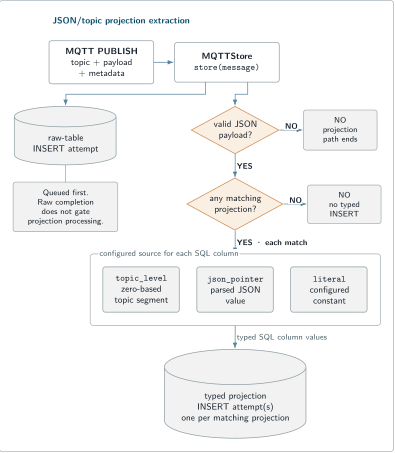

# MQTTStore

MQTTStore is the MQTTSuite MQTT 3.1.1 persistence service. It connects to a broker as an MQTT client, subscribes to configured topic filters, writes every received MQTT publish to a raw MariaDB envelope table, and can independently project selected JSON/topic fields into typed application tables.

The default philosophy is **raw envelope first**:

```text
MQTT publish
  -> raw MQTT row
  -> optional JSON-only typed projections
```

That keeps the original topic, payload, QoS, retain/dup state, and receive context available even when projection schemas evolve.

Use [MQTTIntegrator](../mqttintegrator/README.md) before Store when device/vendor payloads should be normalized first. Use [MQTTCli](../mqttcli/README.md) to generate known test traffic. The whole-suite build and common configuration model are in the [MQTTSuite README](../README.md).

## Quick Start

### 1. Create a MariaDB database and dedicated user

```bash
sudo mariadb
```

```sql
CREATE DATABASE mqttsuite_store
  CHARACTER SET utf8mb4
  COLLATE utf8mb4_unicode_ci;

CREATE USER 'mqttstore'@'127.0.0.1'
  IDENTIFIED BY 'replace-with-a-long-random-password';

GRANT CREATE, INSERT, SELECT, INDEX
  ON mqttsuite_store.*
  TO 'mqttstore'@'127.0.0.1';

FLUSH PRIVILEGES;
```

MQTTStore can auto-create its raw table inside an existing database. It does **not** create the database or database user. Do not run the service as MariaDB `root`.

### 2. Start MQTTStore

```bash
mqttstore \
  --config-file /dev/null \
  in-mqtt --disabled=false \
    remote --host 127.0.0.1 --port 1883 \
    session \
      --client-id mqttstore-local \
      --qos 1 \
    sub --topic 'normalized/#' \
    db \
      --host 127.0.0.1 \
      --database mqttsuite_store \
      --username mqttstore \
      --password 'replace-with-a-long-random-password' \
      storage \
        --raw-table mqtt_messages \
        --auto-create-raw-table
```

The `storage` section is nested below `db`. `--auto-create-raw-table` defaults to `true`; it is shown explicitly so the permission requirement is visible in the command.

### 3. Publish a known message

```bash
mqttcli \
  --config-file /dev/null \
  in-mqtt --disabled=false \
    remote --host 127.0.0.1 --port 1883 \
    session --client-id store-test-publisher --qos 1 \
    pub --topic normalized/room-01/temperature \
        --message '{"value":21.7,"unit":"C"}'
```

### 4. Verify MariaDB

```bash
mariadb -h 127.0.0.1 -u mqttstore -p mqttsuite_store
```

```sql
SELECT id,
       received_at,
       source_instance,
       topic,
       qos,
       retain_flag,
       payload_format,
       payload_text
FROM mqtt_messages
ORDER BY id DESC
LIMIT 5;
```

The latest row should contain topic `normalized/room-01/temperature`, QoS 1, and `payload_format = 'json'`.

## How it works

MQTTStore uses an SNode.C MQTT client connection and adds Store-specific behavior above it. The selected connection instance provides MQTT session/subscription settings and MariaDB/storage settings. Each received PUBLISH is written to raw storage and can additionally feed matching projections.

The same persistence behavior can run above the direct and MQTT-over-WebSocket client families compiled into the application.

## Build and install result

`mqttstore` is part of the repository's top-level CMake build. The Store target requires SNode.C MQTT client and MariaDB database components.

A complete install places:

```text
${CMAKE_INSTALL_PREFIX}/bin/mqttstore
```

MQTTStore does not install a Web UI.

See [Build and install](../README.md#build-and-install) for the complete suite build.

## The raw envelope table

`--auto-create-raw-table` defaults to **`true`**. Explicit forms are:

```text
storage --auto-create-raw-table=true
storage --auto-create-raw-table=false
```

Use `false` when a DBA owns the raw-table DDL and the Store service account should not need `CREATE`/`INDEX` privileges.

The default raw table name is:

```text
mqtt_messages
```

Override it with:

```text
storage --raw-table <identifier>
```

Table names are restricted to letters, digits, and `_`.

The automatically managed table contains:

| Column | Type | Meaning |
| --- | --- | --- |
| `id` | `BIGINT UNSIGNED AUTO_INCREMENT PRIMARY KEY` | stable row id |
| `received_at` | `TIMESTAMP(6)` | database-side receive timestamp |
| `source_instance` | `VARCHAR(255)` | MQTTSuite connection name |
| `topic` | `VARCHAR(1024)` | MQTT topic |
| `qos` | `TINYINT UNSIGNED` | received publish QoS |
| `retain_flag` | `BOOLEAN` | MQTT retain flag |
| `dup_flag` | `BOOLEAN` | MQTT DUP flag |
| `packet_identifier` | `INT UNSIGNED NULL` | packet identifier when represented |
| `payload` | `LONGBLOB` | original payload bytes |
| `payload_text` | `LONGTEXT NULL` | text representation when safe to expose as text |
| `payload_json` | `JSON NULL` | parsed JSON representation when parsing succeeds |
| `payload_format` | `ENUM('json','text','binary')` | payload classification |

The table also creates indexes on `received_at` and the first 255 topic characters.

## Payload classification

MQTTStore always stores the raw payload.

If the payload parses as JSON:

```text
payload_format = json
payload_text   = original payload text
payload_json   = parsed JSON document
```

If JSON parsing fails but the payload is safe text:

```text
payload_format = text
payload_text   = payload text
payload_json   = NULL
```

If binary control content is detected:

```text
payload_format = binary
payload_text   = NULL
payload_json   = NULL
```

The raw `LONGBLOB` remains populated in all cases. This is a storage classification, not a content-type declaration from MQTT.

## Database configuration

The `db` subcommand exposes:

```text
--host
--port
--socket
--database
--username
--password
--flags
```

The source default port is `3306`. The `--socket` option has the non-empty default:

```text
/run/mysqld/mysqld.sock
```

The option is intended to take precedence over host/port when set. For remote deployments, inspect the effective configuration with `--show-config` and verify that the resolved database connection matches the intended host/port/socket model.

For a remote database:

```bash
db \
  --host db.example.net \
  --port 3306 \
  --database mqttsuite_store \
  --username mqttstore \
  --password 'replace-with-a-long-random-password'
```

For a local socket deployment, set `--socket` to the actual server socket.

### Permission profiles

| Model | Typical service grants | Ownership / required Store setting |
| --- | --- | --- |
| raw table auto-create | `CREATE, INSERT, SELECT, INDEX` | default `--auto-create-raw-table=true` |
| DBA-created raw table | `INSERT, SELECT` | DBA owns DDL; use `storage --auto-create-raw-table=false` |
| raw + projections | raw-table permissions plus `INSERT` on projection tables | DBA/application migrations own projection DDL |
| diagnostics user | `SELECT` only | separate observer/dashboard account |

The Store service source inserts data; dashboards and analysts do not need its write credentials.

## MQTT session and subscriptions

The `session` section includes:

```text
--client-id
--qos
--retain-session
--keep-alive
--will-topic
--will-message
--will-qos
--will-retain
--username
--password
--session-store
```

`--retain-session` sets MQTT `clean_session=false`.

Use `--session-store` when local MQTT client/session state should survive Store restarts:

```bash
session \
  --client-id mqttstore-normalized \
  --retain-session \
  --session-store /var/lib/mqttsuite/mqttstore-session.json
```

The `sub --topic` option accepts multiple filters and the same `##<qos>` override syntax used by MQTTCli:

```bash
sub \
  --topic 'normalized/+/temperature##1' \
  --topic 'alerts/###2'
```

The second string represents filter `alerts/#` at QoS 2.

Narrow subscriptions are easier to operate than a universal `#` when only a defined telemetry namespace belongs in the database.

## Optional typed projections

Raw storage works without projections.

A projection is an additional insert into an operator-managed typed table when:

1. the raw message payload is valid JSON;
2. the message topic matches the projection's MQTT filter.

The current schema is [`lib/projection-schema.json`](lib/projection-schema.json). A projection file may be an array directly or an object containing `projections`.

The `storage` option is:

```text
--projection-file <file>
```

Projection configuration is loaded and validated when the MQTT connection reaches Store context creation. A malformed projection plan prevents that connection from becoming operational; the exact whole-process/retry consequence remains **[UNVERIFIED-RUNTIME]** in the current qualification.

## A complete projection example

Assume normalized messages arrive on:

```text
normalized/<device>/temperature
```

with payload:

```json
{"value":21.7,"unit":"C"}
```

Create a typed table:

```sql
CREATE TABLE sensor_measurements (
    id BIGINT UNSIGNED NOT NULL AUTO_INCREMENT PRIMARY KEY,
    device_id VARCHAR(255) NOT NULL,
    metric VARCHAR(255) NOT NULL,
    value DOUBLE NULL,
    unit VARCHAR(64) NULL,
    received_at TIMESTAMP(6) NOT NULL DEFAULT CURRENT_TIMESTAMP(6)
);
```

Create `projections.json`:

```json
{
  "projections": [
    {
      "name": "room_temperature",
      "topic": "normalized/+/temperature",
      "table": "sensor_measurements",
      "columns": {
        "device_id": {
          "topic_level": 1,
          "required": true
        },
        "metric": {
          "literal": "temperature"
        },
        "value": {
          "json_pointer": "/value",
          "required": true
        },
        "unit": {
          "json_pointer": "/unit"
        }
      }
    }
  ]
}
```

Start Store with the projection file:

```bash
mqttstore \
  in-mqtt --disabled=false \
    remote --host 127.0.0.1 --port 1883 \
    session --client-id mqttstore-projection --qos 1 \
    sub --topic 'normalized/#' \
    db \
      --database mqttsuite_store \
      --username mqttstore \
      --password 'replace-with-a-long-random-password' \
      storage \
        --projection-file ./projections.json
```

<picture>
  <source media="(max-width: 600px)" srcset="../assets/json-topic-projection-extraction-mobile.svg">
  
</picture>

## Projection sources

A projection column can obtain its value from:

- `json_pointer` — extract from the parsed JSON payload;
- `topic_level` — extract one level from the MQTT topic;
- `literal` — insert a configured constant.

The projection plan also controls the target SQL column/type conversion and whether a missing value is required.

### Required versus optional values

If a source value is missing:

- `required: false` — the column is omitted from the generated INSERT;
- `required: true` — the column is included with SQL `NULL`.

This lets database defaults apply to optional omitted columns while keeping required extraction failures visible as explicit `NULL` values.

## Raw storage and projections are independent

The raw-envelope write and optional projection writes are separate database operations. A projection failure does not redefine the raw payload, and projection-table DDL remains operator-owned.

This means a deployment should monitor both raw persistence and projection errors independently.

## Security and operational boundaries

- Database credentials can appear in command lines and saved configuration. Protect shell history, config files and process visibility accordingly.
- Debug logs may contain connection/application data; review them before sharing.
- Projection tables, migrations, retention, backups and database lifecycle are operator responsibilities.
- MQTT TLS protects the broker connection when configured correctly; MariaDB transport protection and authorization are separate deployment concerns.

## Troubleshooting

### Raw table is not created

Confirm:

- the database exists;
- `storage --auto-create-raw-table=true` is effective;
- the table name contains only letters/digits/underscore;
- the service user has the required `CREATE` and `INDEX` privileges.

For a DBA-managed table, use `storage --auto-create-raw-table=false` and verify the table exists.

### Projection plan is rejected

Check JSON syntax and [`lib/projection-schema.json`](lib/projection-schema.json). Projection loading happens when the MQTT connection reaches Store context creation. The exact whole-process/retry consequence is `[UNVERIFIED-RUNTIME]` in the current qualification.

### Raw row exists but projection does not

Check:

- payload is valid JSON;
- topic matches the projection filter;
- JSON Pointer/topic-level indexes select existing values;
- target table exists;
- service user can `INSERT` into the projection table;
- target SQL column types accept the converted values.

### Payload is classified as binary

Review the raw payload bytes. The classifier treats NUL and non-text control content as binary when JSON parsing has already failed.

## Related documentation

- [MQTTSuite overview and build](../README.md)
- [Configuration](../docs/configuration.md)
- [Capabilities and evidence](../docs/capabilities.md)
- [Store storage and projection reference](../docs/store-storage.md)
- [Projection schema](lib/projection-schema.json)
- [MQTTBroker](../mqttbroker/README.md)
- [MQTTIntegrator](../mqttintegrator/README.md)
- [MQTTBridge](../mqttbridge/README.md)
- [MQTTCli](../mqttcli/README.md)

The older implementation-repository `docs/mqttstore-user-guide.md` is intentionally not used as the canonical publication route.

## License

MQTTSuite is available under:

```text
MIT OR GPL-3.0-or-later
```
