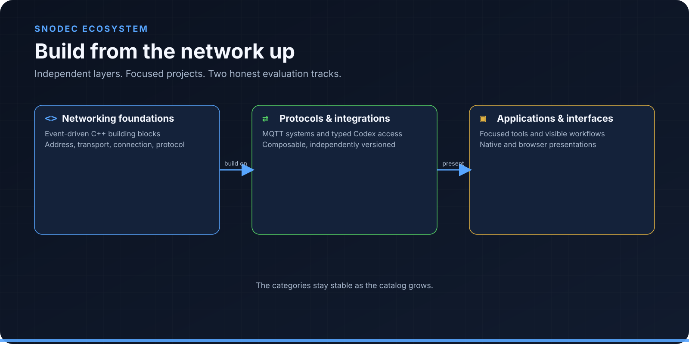
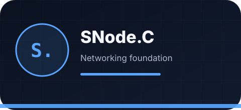
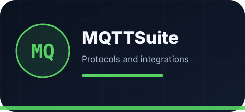
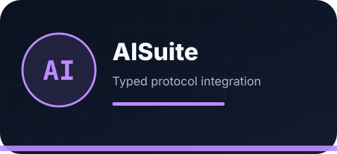
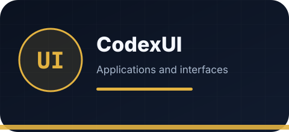
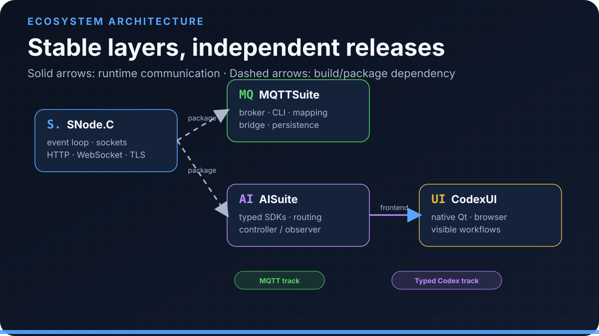
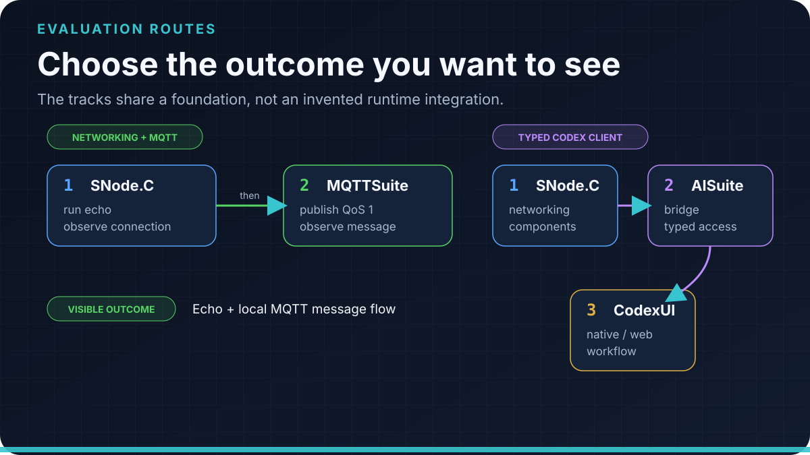

# SNodeC

### Event-driven C++ networking, protocol integration, and user interfaces

Start with the networking foundation, choose the protocol or integration layer
you need, then evaluate a focused application without adopting a monolithic
stack.

[Explore projects](#explore-projects) · [Run a demo](#run-a-demo) ·
[How the ecosystem fits](#how-the-ecosystem-fits) ·
[GitHub organization](https://github.com/SNodeC)

Figure: An extensible ecosystem built from the networking foundation upward.

SNodeC develops independently versioned open-source projects around an
event-driven C++ networking foundation. The current catalog covers reusable
network layers, MQTT 3.1.1 applications, typed Codex app-server integration,
and native/browser interfaces. Each project can be evaluated on its own; ecosystem
relationships are stated explicitly rather than implied by a shared name.

> [!IMPORTANT]
> AISuite and CodexUI are independent open-source projects. They are not
> official OpenAI SDKs or applications.

## What you can build

- **Network clients, servers, and gateways** with reusable address, stream,
  TLS, connection, HTTP, WebSocket, and application-protocol layers.
- **MQTT 3.1.1 systems** that separate broker, command-line inspection,
  transformation, broker-to-broker routing, and persistence responsibilities.
- **C++ and browser Codex integrations** with generated protocol types and one
  bounded bridge for controller and observer clients.
- **Visible desktop workflows** for threads, turns, prompts, plans, agents,
  tool activity, connection state, and Git changes.

## Explore projects

The directory is organized by stable categories, not by a fixed project count.
New repositories can be added with the same outcome, audience, evidence, and
navigation fields.

### Networking foundations

#### [SNode.C](https://github.com/SNodeC/snode.c)

Build event-driven C++20 network applications from named client/server
instances, per-connection contexts, and composable network layers. Start here
when you need the framework itself or when another SNodeC project is a build
dependency.

**Best for:** C++ networking and systems developers 
**First result:** IPv4, IPv6, Unix-domain, or mutual-TLS echo connection 
[Repository](https://github.com/SNodeC/snode.c) ·
[Documentation](https://snodec.github.io/snode.c-doc/html/index.html) ·
[Quick start](https://github.com/SNodeC/snode.c#quick-start)

### Protocols and integrations

#### [MQTTSuite](https://github.com/SNodeC/mqttsuite)

Operate five focused MQTT 3.1.1 applications: MQTTBroker, MQTTCli,
MQTTIntegrator, MQTTBridge, and MQTTStore. Choose it for local message flows,
payload/topic transformation, broker routing, or MariaDB-backed persistence.

**Best for:** IoT, edge, MQTT, and integration engineers 
**First result:** local broker → QoS 1 subscriber → JSON publisher 
[Repository](https://github.com/SNodeC/mqttsuite) ·
[Documentation](https://snodec.github.io/mqttsuite-doc/html/index.html) ·
[Quick start](https://github.com/SNodeC/mqttsuite#quick-start)

#### [AISuite](https://github.com/SNodeC/AISuite)

Integrate C++ and browser clients with the Codex app-server through generated
typed surfaces, bounded framing, and a controller/observer bridge. Choose it
when several clients should share one provider connection without each
implementing the protocol boundary.

**Best for:** C++, browser, AI-tooling, and protocol developers 
**First result:** qualified bridge tests plus a reference-client list request 
[Repository](https://github.com/SNodeC/AISuite) ·
[Architecture](https://github.com/SNodeC/AISuite/blob/master/src/ai/openai/codex/docs/architecture.md) ·
[Quick start](https://github.com/SNodeC/AISuite#quick-start)

### Applications and interfaces

#### [CodexUI](https://github.com/SNodeC/CodexUI)

Use native Qt 6 or browser presentations to navigate Codex threads and turns,
submit prompts, follow activity, and keep target, running, selected, controller,
and connection states visible. Native-only integrations remain labeled.

**Best for:** Codex users and Qt/C++/frontend contributors 
**First result:** qualified native build plus a verified static browser artifact 
[Repository](https://github.com/SNodeC/CodexUI) ·
[UI behavior](https://github.com/SNodeC/CodexUI/blob/master/docs/ui-behavior.md) ·
[Quick start](https://github.com/SNodeC/CodexUI#build-and-first-run)

## How the ecosystem fits

SNode.C supplies networking components to the downstream builds. MQTTSuite is
the MQTT application track. AISuite is the Codex protocol/integration track;
CodexUI provides native and browser presentations built on it. The two tracks are separate—there
is no invented MQTTSuite-to-CodexUI runtime path.

Figure: Stable ecosystem layers with solid runtime paths and dashed build dependencies.

Projects keep independent source versions and release histories. Compatibility
must be demonstrated with exact revisions. The last coordinated qualification
on 28 August 2026 built current SNode.C, MQTTSuite, AISuite, and CodexUI heads
in dependency order on Debian GNU/Linux forky/sid, x86-64, GCC 16.2.0. AISuite
passed 27 C++ and 20 TypeScript tests; CodexUI passed 7 native and 30 web tests;
MQTTSuite's basic broker/CLI flow and
SNode.C's selected echo transports were run directly.

## Run a demo

Figure: Choose one qualified route; the diagram does not imply a cross-track runtime path.

Choose the result you want to see:

### Networking and MQTT

1. Complete the [SNode.C quick start](https://github.com/SNodeC/snode.c#quick-start).
2. Run the [MQTTSuite broker/subscriber/publisher flow](https://github.com/SNodeC/mqttsuite#quick-start).
3. Observe `edge-lab/room-01/temperature` carrying
   `{"value":21.7,"unit":"C"}` at QoS 1.

This route proves a framework echo and an application-level MQTT message flow.
Mapping, bridge, storage, Web UI, TLS, and deployment policy have separate
qualification requirements.

### Typed Codex client

1. Build and install SNode.C.
2. Build AISuite and run its [C++ and TypeScript qualification](https://github.com/SNodeC/AISuite#quick-start).
3. Start `codex-bridge`, then build and launch [CodexUI](https://github.com/SNodeC/CodexUI#build-and-first-run).

This route keeps both transport directions visible: bridge to app-server and
CodexUI to bridge. Authentication and visible conversation results depend on
the evaluator's Codex configuration; do not use private prompts in launch
captures.

## Evidence and compatibility

| Project | Current source marker | Last coordinated evidence |
| --- | --- | --- |
| SNode.C | CMake `2.0.0`; current master newer than latest public tag | Build/install; IPv4, IPv6, Unix-domain, mutual-TLS echo paths |
| MQTTSuite | CMake `1.0.1`; tested master newer than `v1.0.1` | All five executables built; local QoS 1 broker/CLI flow |
| AISuite | CMake `0.7.0`; TypeScript source `1.0.0`; no public tag/npm package | Build/install; 27/27 C++ and 20/20 TypeScript tests |
| CodexUI | Native/web source `1.0.0`; no public tag/release | Native 7/7 and web 30/30 tests; static artifact verified |

These are exact-revision observations, not blanket maturity, support, or
platform statements. Follow each repository's README and releases before
depending on a moving `master` head.

## Community and project routes

Each repository owns its technical documentation, issues, releases, and
license. SNode.C also has [GitHub Discussions](https://github.com/SNodeC/snode.c/discussions).
Dedicated organization-wide security, support, and contribution policy files
are not yet published, so the profile does not invent those links. Use public
issues only for non-sensitive, reproducible reports and never attach tokens,
credentials, certificates, private prompts, or proprietary source.

Contributions should begin in the repository that owns the behavior: framework
changes in SNode.C, MQTT workflows in MQTTSuite, protocol/bridge work in
AISuite, and presentation behavior in CodexUI.
