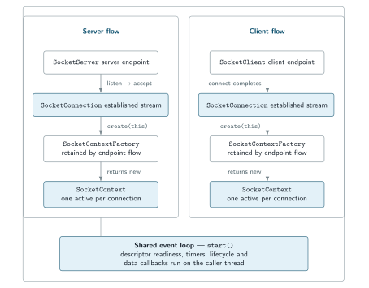

# SNode.C

**Event-driven network clients and servers in C++20**

SNode.C is a C++20 networking framework for building network clients, servers,
and protocol endpoints around a shared event-driven runtime. It centralizes
connection lifecycle, event dispatch, stream/TLS mechanics, and endpoint
configuration so protocol code can stay focused on what happens on one
connection.

SNode.C is designed primarily for machine-to-machine (M2M) communication and
IoT-oriented network applications, while its connection and protocol model is
general-purpose.

The core model is connection-local: a configured `SocketServer` or
`SocketClient` establishes a `SocketConnection`; that connection asks its
endpoint flow's `SocketContextFactory` for the `SocketContext` that handles
protocol and application events. The same model is used by custom stream
protocols and the framework's HTTP, WebSocket, EventSource/SSE, and MQTT 3.1.1
components.

**C++20** ·
[MIT OR LGPL-3.0-or-later](https://github.com/SNodeC/snode.c/blob/master/LICENSE)

**[Run the echo pair](#run-the-echo-pair)** ·
**[See the programming model](#the-programming-model)** ·
**[Check capabilities](#capabilities-at-a-glance)** ·
**[Browse examples](https://github.com/SNodeC/snode.c/tree/master/src/apps)**

## The programming model

Start with the lifecycle rather than the protocol list. A `SocketServer` follows
the listen/accept path and a `SocketClient` follows the connect path. Each
endpoint flow retains its own `SocketContextFactory`. Once a transport
connection is established, its `SocketConnection` calls that retained factory
with `create(this)`; the returned `SocketContext` becomes the connection-local
protocol/application behavior. One context is active for a connection at a time.

<picture>
  <source media="(max-width: 600px)" srcset="assets/programming-model-mobile.svg">
  
</picture>

| Role | Responsibility |
| --- | --- |
| `SocketServer` / `SocketClient` | Configure and initiate the server or client endpoint flow. |
| `SocketConnection` | Own the established stream and its active context. |
| `SocketContextFactory` | Create connection-local behavior for that endpoint flow. |
| `SocketContext` | Handle protocol/application callbacks for one connection. |
| Event loop | Dispatch descriptor, timer, lifecycle, and data work. |

In the echo source, the server alias is written with the build-time `NET` macro.
For the plain IPv4 target, `NET` resolves to `in`, so the concrete composition is:

```cpp
using EchoSocketServer =
    net::in::stream::legacy::SocketServer<EchoServerSocketContextFactory>;
```

The supplied [echo context](https://github.com/SNodeC/snode.c/blob/bf01683a53b48220a840522e8ccaf3b48e58c240/src/apps/echo/model/EchoSocketContext.cpp)
shows what connection-local behavior looks like (logging omitted):

```cpp
void EchoSocketContext::onConnected() {
    if (role == Role::CLIENT) {
        sendToPeer("Hello peer! Nice to see you!!!");
    }
}

std::size_t EchoSocketContext::onReceivedFromPeer() {
    char chunk[4096];
    const std::size_t chunklen = readFromPeer(chunk, 4096);

    if (chunklen > 0) {
        sendToPeer(chunk, chunklen);
    }

    return chunklen;
}
```

`start()` runs the framework event loop synchronously on the thread that calls
it. SNode.C does not create a framework worker pool, so a blocking or
long-running callback delays other work on that loop. Applications may introduce
their own concurrency.

Because the context is separate from the connection, SNode.C can replace the
active context while retaining the established `SocketConnection`. The
[HTTP-to-WebSocket transition](#architecture-and-extension-points) below is a
concrete use of that mechanism.

## Run the echo pair

The supplied plain IPv4 echo server and client are the shortest independently
qualified way to see the endpoint/connection/context lifecycle running on
loopback.

For this source-build path, provide Git, a project-accepted C++20 compiler,
CMake 3.18+, Ninja, pkg-config, OpenSSL development files, and nlohmann/json
3.11+. A fresh default configure also needs network access for its pinned
dependency fetch.

Clone `master` and build only the two echo targets:

```sh
git clone https://github.com/SNodeC/snode.c.git
cd snode.c

cmake -S . -B cmake-build-release -G Ninja \
  -DCMAKE_BUILD_TYPE=Release \
  -DSNODEC_BUILD_APPS=ON \
  -DSNODEC_BUILD_TESTS=OFF \
  -DCHECK_INCLUDES=OFF

cmake --build cmake-build-release --parallel \
  --target echoserver-legacy-in echoclient-legacy-in

mkdir -p cmake-build-release/echo-config
```

Here, `legacy` names the plain, non-TLS stream variant. `CHECK_INCLUDES=OFF`
keeps the optional IWYU include-analysis pass out of this first build when IWYU
is installed.

The fresh `XDG_CONFIG_HOME` points SNode.C at an isolated configuration root, so
existing user configuration cannot change the defaults used below.
Information-level text logging is already the default; `--monochrom=true` makes
the shown output independent of terminal color support.

Start the server:

```sh
XDG_CONFIG_HOME="$PWD/cmake-build-release/echo-config" \
  ./cmake-build-release/src/apps/echo/echoserver-legacy-in \
  --monochrom=true \
  echoserver local --host 127.0.0.1 --port 18001
```

Then start the client from the same checkout in a second terminal:

```sh
XDG_CONFIG_HOME="$PWD/cmake-build-release/echo-config" \
  ./cmake-build-release/src/apps/echo/echoclient-legacy-in \
  --monochrom=true \
  echoclient remote --host 127.0.0.1 --port 18001
```

Ignoring timestamps and logger prefixes, the run produces:

```text
role=server inst=echoserver — listener started
echoserver: listening on '127.0.0.1:18001'
role=server inst=echoserver conn=1 — transport connected

echoclient: connected to '127.0.0.1:18001 (127.0.0.1)'
role=client inst=echoclient conn=1 — transport connected
```

These lines prove that the listener started and one plain IPv4 loopback
connection formed. At the default information level the logger does not print
the reflected payload; the linked context source reflects each received chunk,
and the pair continues echoing until you stop both processes with Ctrl-C.

Plain IPv6 loopback, a Unix-domain plain stream path, and one mutual-TLS IPv4
echo arrangement were also separately qualified.

Commands and output were verified against
[`bf01683`](https://github.com/SNodeC/snode.c/commit/bf01683a53b48220a840522e8ccaf3b48e58c240)
on 29 August 2026.

## Capabilities at a glance

For a framework evaluation, it matters both what SNode.C implements and how far
that surface has been exercised. This is a fit-check, not a claim that every
address-family × connection-mode × protocol combination has equivalent test
coverage.

- **Event runtime.** **Available:** Descriptor/timer loop; server/client stream
  endpoints; connection-local contexts. `epoll` is the default; `poll` and
  `select` are configure-time alternatives. **Exercised:** CI on the reviewed
  commit ran the root test suite. Current CI/runtime evidence exercised default
  `epoll` only.
- **Plain streams.** **Available:** IPv4, IPv6, and Unix-domain server/client
  paths. **Exercised:** Component tests plus recorded echo runs for all three.
- **TLS streams.** **Available:** OpenSSL-backed TLS connection layer and
  configuration. **Exercised:** TLS state/ownership/shutdown tests plus one
  mutual-TLS IPv4 echo run. Trust, hostname, certificate, and cipher policy
  remain application/operator responsibilities.
- **Bluetooth.** **Available:** Conditional RFCOMM and L2CAP stream layers with
  BlueZ. **Exercised:** The reviewed CI build included BlueZ; no hardware runtime
  qualification.
- **Web protocols.** **Available:** HTTP/1.0 and HTTP/1.1, Express-style
  routing/middleware, WebSocket version 13, and EventSource/SSE. **Exercised:**
  Broad plain-IPv4 HTTP tests, smaller IPv6/Unix HTTP and WebSocket paths, and
  plain-IPv4 SSE tests. No HTTP/2 claim; “Express-style” is not Node.js Express
  compatibility.
- **MQTT.** **Available:** MQTT 3.1.1 client/server and MQTT-over-WebSocket
  components. **Exercised:** Packet/lifecycle tests; MQTTSuite has a separately
  qualified IPv4 QoS 1 path. No MQTT 5; MQTT-over-WebSocket network evidence is
  narrower.

The reviewed `master` is source-buildable and locally installable, but it is
newer than the latest GitHub release, `v1.0.2`, and is not represented by a
current tagged 2.0 release or a published current-head binary package. Current
platform evidence includes one Linux/GCC CI lane and one Debian/x86-64 Release
qualification; it does not establish a broad operating-system, compiler, or
architecture support matrix. No throughput, latency, or footprint claim is made
here.

See the [capability map](docs/capabilities.md) for detailed protocol, transport,
build, platform, and evidence scope, including optional components and tooling.

## Architecture and extension points

A concrete endpoint selects a compatible address/network family, plain or
OpenSSL-backed TLS stream mode, server or client role, and application context
around the shared event runtime. Custom `SocketContextFactory` and
`SocketContext` implementations are the direct extension point. The
[architecture guide](docs/architecture.md) shows the full composition and its
boundaries.

The connection/context split also supports a protocol transition without opening
a second transport connection. During an HTTP-to-WebSocket upgrade, the selected
WebSocket factory creates a replacement context while HTTP remains active.
`setSocketContext(new)` stages it, and the upgrade-status/application callback
calls `response->end()` to queue `101 Switching Protocols`. After the current
HTTP read callback returns, the HTTP context detaches with
`DetachReason::ContextSwitch` and is removed, the active pointer changes, and
the WebSocket `SocketContextUpgrade` attaches to the same established
`SocketConnection`. SSE/EventSource follows a different HTTP-layer path: it
keeps the HTTP context and streams server-to-client events rather than replacing
the active protocol context.

<picture>
  <source media="(max-width: 600px)" srcset="assets/http-websocket-context-switch-mobile.svg">
  
</picture>

*Same connection, new active context.*

A named endpoint can expose one typed configuration hierarchy through C++ API
defaults, a configuration file, and generated command-line sections:

**command line > configuration file > API/default**

The [configuration guide](docs/configuration.md) covers named instances,
role-specific sections, inspection commands, TLS policy, and the responsive
configuration figure. SNode.C also installs componentized namespaced CMake
targets; tests include selected installed consumers.

## Choose your next step

| If you want to… | Go here |
| --- | --- |
| Understand ownership, lifecycle, composition, and extension points | [Architecture](docs/architecture.md) |
| Configure named endpoints, CLI/file overrides, retry, reconnect, or TLS | [Configuration](docs/configuration.md) |
| Check exact protocol, transport, build, platform, and qualification scope | [Capabilities](docs/capabilities.md) |
| Start from working source examples | [Example applications](https://github.com/SNodeC/snode.c/tree/master/src/apps) |
| Inspect or discuss the project | [Source](https://github.com/SNodeC/snode.c) · [Issues](https://github.com/SNodeC/snode.c/issues) · [Discussions](https://github.com/SNodeC/snode.c/discussions) · [Releases](https://github.com/SNodeC/snode.c/releases) |

SNode.C is the networking foundation for two distinct ecosystem paths.
[MQTTSuite](https://github.com/SNodeC/mqttsuite) provides MQTT broker,
integration, bridge, CLI, and storage applications.
[AISuite](https://github.com/SNodeC/AISuite) provides typed Codex integration and
bridging, with [CodexUI](https://github.com/SNodeC/CodexUI) as the
native/browser presentation project in that path. These are related projects,
not one shared-version distribution or one all-project runtime pipeline. AISuite
and CodexUI are independent open-source projects, not official OpenAI products.

If the connection/context split matches the architecture you want, continue with
the [architecture guide](docs/architecture.md). If you prefer to evaluate by
code, [browse the examples](https://github.com/SNodeC/snode.c/tree/master/src/apps).
