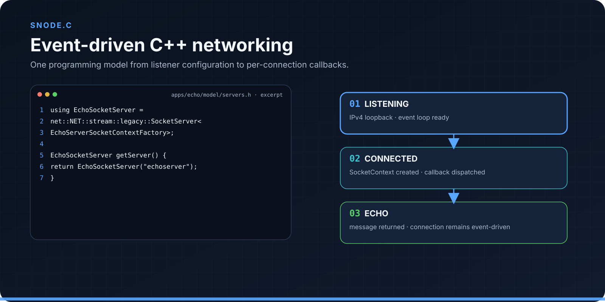
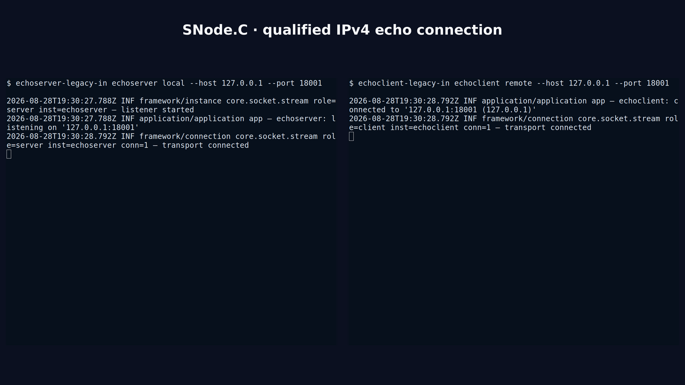

<div align="center">

# SNode.C

### Build event-driven network applications in modern C++

SNode.C separates connection handling from application protocol logic. Define
what should happen for one connection, then place that behavior behind a
configurable client or server using the network path the application needs.


[Quick start](#quick-start) · [Programming model](#programming-model) ·
[Architecture](docs/architecture.md) · [Configuration](docs/configuration.md) ·
[Capability map](docs/capabilities.md) ·
[API reference](https://snodec.github.io/snode.c-doc/html/index.html)

</div>



<sub>Application code supplies connection-local behavior; SNode.C owns the surrounding event and connection lifecycle.</sub>

> [!NOTE]
> This presentation follows public `master`. The most recently qualified source
> is commit [`bf01683`](https://github.com/SNodeC/snode.c/commit/bf01683a53b48220a840522e8ccaf3b48e58c240),
> whose CMake source version is `2.0.0`. Current master is newer than the latest
> public tag, so that number is not presented as a release or maturity claim.

## Why SNode.C

Networking code tends to grow sideways. A small listener acquires address
parsing, connection state, buffering, timeouts, retries, TLS, protocol framing,
configuration, and shutdown behavior. When a second address family or client
path arrives, application logic is often duplicated inside another set of
callbacks.

SNode.C gives those concerns explicit places. The runtime observes descriptors
and timers. Client and server instances establish connections. A factory creates
one protocol context for every accepted or established connection. That context
owns the application-facing lifecycle and processes data without taking over
socket setup or event dispatch.

This division is useful in several different kinds of program:

- a service can expose the same protocol through separately configured
  endpoints;
- a client can reconnect without turning its protocol state into global state;
- an HTTP connection can move into a WebSocket context without replacing the
  underlying connection;
- applications can start at raw stream callbacks or use the supplied HTTP,
  WebSocket, Express-style, and MQTT components where their verified scope fits.

The architecture is inspired by the clarity of event-driven runtimes, including
Node.js, but SNode.C is a C++ framework with its own API and type system. It does
not provide Node.js, JavaScript, npm, or Express compatibility.

## Quick start

The shortest evaluation path is the supplied IPv4 echo pair. The build stays in
the canonical `cmake-build-release` directory, which can be reused for
incremental builds while the compiler, generator, options, dependencies, and
source revision remain unchanged.

### 1. Install the build requirements

For Debian or Ubuntu, these packages cover the qualified baseline build:

```sh
sudo apt update
sudo apt install --yes \
  build-essential ca-certificates cmake git ninja-build pkgconf \
  libssl-dev nlohmann-json3-dev
```

The following packages enable corresponding optional components or maintainer
targets. They are not all required for the echo run:

```sh
# Optional features: Bluetooth RFCOMM/L2CAP, MIME detection, MariaDB,
# the snodec-control TUI, and certificate generation/inspection.
sudo apt install --yes \
  libbluetooth-dev libmagic-dev libmariadb-dev libncurses-dev openssl

# Optional maintainer tools: API documentation and graphs, include analysis,
# and source/CMake formatting.
sudo apt install --yes \
  doxygen graphviz iwyu clang-format cmake-format
```

`libssl-dev` is mandatory for the current default source graph. CLI11 is
vendored as a single header, and CMake fetches the pinned spdlog source during
the first configure. The quick start explicitly disables include analysis even
when IWYU is installed.

### 2. Build the echo applications

```sh
git clone https://github.com/SNodeC/snode.c.git
cd snode.c

cmake -S . -B cmake-build-release -G Ninja \
  -DCMAKE_BUILD_TYPE=Release \
  -DSNODEC_BUILD_APPS=ON \
  -DSNODEC_BUILD_TESTS=OFF \
  -DCHECK_INCLUDES=OFF
cmake --build cmake-build-release --parallel \
  --target echoserver-legacy-in echoclient-legacy-in
export PATH="$PWD/cmake-build-release/src/apps/echo:$PATH"
```

### 3. Listen, connect, and observe the contexts

Start the listener in one terminal:

```sh
echoserver-legacy-in echoserver local --host 127.0.0.1 --port 18001
```

Connect from a second terminal:

```sh
echoclient-legacy-in echoclient remote --host 127.0.0.1 --port 18001
```

The server reports its listener, the client reports a successful connection,
and both processes attach their echo contexts. The client sends a greeting and
the peers reflect received data. Stop both processes with
<kbd>Ctrl</kbd>+<kbd>C</kbd>.



<sub>Genuine terminal output from the qualified loopback run at the recorded source revision.</sub>

### Keep the echo behavior; change the network path

The same echo model is compiled into several endpoint variants. The following
IPv6, Unix-domain, and mutual-TLS IPv4 paths were run during qualification:

```sh
cmake --build cmake-build-release --parallel --target \
  echoserver-legacy-in6 echoclient-legacy-in6 \
  echoserver-legacy-un echoclient-legacy-un \
  echoserver-tls-in echoclient-tls-in
```

| Variant | Listener | Client |
| --- | --- | --- |
| IPv6 stream | `echoserver-legacy-in6 echoserver local --host ::1 --port 18002` | `echoclient-legacy-in6 echoclient remote --host ::1 --port 18002` |
| Unix domain | `echoserver-legacy-un echoserver local --sun-path /tmp/snode-echo.sock` | `echoclient-legacy-un echoclient remote --sun-path /tmp/snode-echo.sock` |
| Mutual TLS over IPv4 | `echoserver-tls-in echoserver local --host 127.0.0.1 --port 18443 tls --cert server.crt --cert-key server.key --ca-cert ca.crt` | `echoclient-tls-in echoclient remote --host 127.0.0.1 --port 18443 tls --cert client.crt --cert-key client.key --ca-cert ca.crt` |

The TLS pair requires separate server and client certificates signed by the CA
named through `--ca-cert`. This example does not make certificate verification,
host policy, or deployment security automatic. Use reviewed certificates and
inspect the complete compiled TLS surface with
`echoserver-tls-in --help=expanded`.

## Programming model


<sub>A named client or server instance establishes a connection; its factory creates the context that owns protocol behavior for that connection.</sub>

Four concepts recur throughout the framework:

1. A **client or server instance** describes one configurable endpoint. A
   server accepts connections; a client initiates them.
2. A **connection** owns the established stream, addresses, queues, timeouts,
   and connection-level state.
3. A **`SocketContextFactory`** chooses and creates the application context for
   that connection.
4. A **`SocketContext`** receives attach, data, error, signal, and detach
   events and sends through its connection.

The supplied echo model is intentionally small. Its client context sends the
first message from `onConnected()`. Both roles read available data from
`onReceivedFromPeer()` and write it back through `sendToPeer()`. On detach, the
context can distinguish a connection close from a context switch.

That last distinction matters above raw streams. SNode.C can replace the
application context while retaining the established connection. The HTTP and
WebSocket code uses this mechanism for protocol upgrades, with an upgrade
factory selecting the next context. The detailed
[architecture guide](docs/architecture.md) shows this transition without
turning the landing page into a class diagram.

## Architecture by composition


<sub>Layers can be selected independently in source, but only explicitly qualified paths should be treated as tested combinations.</sub>

The bottom of the stack is shared infrastructure: descriptor readiness, timers,
the event queue, and the selected multiplexer implementation. Address-family
types and physical sockets sit above that runtime. Stream clients and servers
then establish connections, optionally using the OpenSSL-backed TLS layer.
Application protocol contexts finally attach connection-local behavior.

Composition is not a support matrix. The current source contains IPv4, IPv6,
Unix-domain, Bluetooth RFCOMM, and Bluetooth L2CAP layers, but the launch
qualification exercised only IPv4, IPv6, Unix-domain, and mutual TLS over IPv4
for the echo example. A class or build target existing does not prove that
every adjacent layer has been tested with it.

Read [Architecture and extension points](docs/architecture.md) for the event
runtime, endpoint composition, ownership model, and HTTP-to-WebSocket context
transition.

## Capabilities and boundaries

| Area | Present in current source | Public boundary |
| --- | --- | --- |
| Event runtime | Event loop, event queue, timers, descriptor events, and select/poll/epoll multiplexer implementations | Architecture statement only; no throughput or latency claim |
| Network families | IPv4, IPv6, Unix domain, RFCOMM, and L2CAP source layers | Echo runtime evidence currently covers IPv4, IPv6, and Unix domain |
| Connections | Client/server stream connections, queues, timeouts, retry controls, client reconnect, and plain/TLS variants | Exact behavior depends on the concrete instance and configuration |
| Web protocols | HTTP client/server parsing, Express-style server routing, WebSocket upgrades, and WebSocket subprotocol infrastructure | Source and tests define individual components; this page does not claim every network combination |
| MQTT | MQTT 3.1.1 protocol components and MQTT-over-WebSocket composition | Ready-made broker, integration, bridge, CLI, and storage workflows belong to MQTTSuite |
| Configuration | API setters, command-line sections, configuration files, effective-config inspection, and config-file writing | Named instances expose CLI/file configuration; anonymous instances are API-configured |
| Database and content helpers | MariaDB integration and optional MIME detection | Built only when the corresponding dependencies and components are selected |
| Packaging | Installed CMake component packages for downstream `find_package` consumers | Release artifact and broad platform support remain separate questions |

The [current-master capability map](docs/capabilities.md) separates source,
test, runtime, and release evidence and lists the dependencies attached to each
area.

## Configuration that follows the instance

An instance is more than a port number. Its configuration tree separates local
and remote addresses, established-connection behavior, physical-socket policy,
and TLS. Server and client roles expose different required sections: a server
needs a local listener address, while a client needs a remote destination.

The same model can be set in C++, loaded from a configuration file, or
overridden on the command line. Useful inspection paths are built into the
application surface:

```sh
echoserver-legacy-in --help=expanded
echoserver-legacy-in --show-config
echoserver-legacy-in --command-line=complete
```

This makes a named endpoint inspectable without moving deployment choices back
into protocol code. Retry, timeout, queue, reconnect, certificate, CA, cipher,
and SNI options remain explicit rather than implied by the word “networking.”

Read [Configuration without duplicated policy](docs/configuration.md) for the
hierarchy, precedence, named/anonymous distinction, and deployment checks.

## Build, install, and consume

SNode.C requests C++20 and CMake 3.18 or newer. The recorded qualification used
Debian GNU/Linux forky/sid on x86-64 with GCC 16.2.0, CMake 4.3.4, and Ninja
1.13.2. That is a reproducible observation, not a declaration that every Linux
distribution, compiler, architecture, Android/Termux environment, or OpenWrt
target is supported.

For development, keep separate canonical Release and Debug build directories.
Enable tests in the Debug configuration and run them through CTest:

```sh
cmake -S . -B cmake-build-debug -G Ninja \
  -DCMAKE_BUILD_TYPE=Debug \
  -DSNODEC_BUILD_APPS=ON \
  -DSNODEC_BUILD_TESTS=ON
cmake --build cmake-build-debug --parallel
ctest --test-dir cmake-build-debug --output-on-failure
```

Install from the build tree rather than copying libraries or headers manually:

```sh
cmake --install cmake-build-release --prefix "$PWD/snodec-install"
```

Downstream CMake projects can consume the installed component packages with
`find_package`. Select only the components the program uses; do not rely on a
sibling source checkout or assume that an optional dependency is available
because another SNode.C component built successfully.

## Projects built around SNode.C

SNode.C is the networking foundation, not the entire application story:

- [MQTTSuite](https://github.com/SNodeC/mqttsuite) provides separate MQTT 3.1.1
  broker, integration, bridge, CLI, and storage applications.
- [AISuite](https://github.com/SNodeC/AISuite) uses SNode.C for typed integration
  and multi-client bridge paths around the Codex app-server protocol.
- [CodexUI](https://github.com/SNodeC/CodexUI) provides native and browser
  presentations built on the AISuite integration layer.

Each project has its own version, support boundary, and documentation. Their
features are not automatically framework features.

## Documentation and project routes

| Need | Route |
| --- | --- |
| Understand the layers and extension points | [Architecture guide](docs/architecture.md) |
| Configure endpoints and deployment policy | [Configuration guide](docs/configuration.md) |
| Check evidence and optional dependencies | [Capability map](docs/capabilities.md) |
| Browse generated classes and namespaces | [API reference](https://snodec.github.io/snode.c-doc/html/index.html) |
| Study complete applications | [Example sources](https://github.com/SNodeC/snode.c/tree/master/src/apps) |
| Report a reproducible defect | [GitHub Issues](https://github.com/SNodeC/snode.c/issues) |
| Ask a usage question | [GitHub Discussions](https://github.com/SNodeC/snode.c/discussions) |
| Inspect published artifacts | [GitHub Releases](https://github.com/SNodeC/snode.c/releases) |

SNode.C is available under `MIT OR LGPL-3.0-or-later`. Review the repository
license files before redistribution. The repository does not currently publish
dedicated `SECURITY.md`, `SUPPORT.md`, or `CONTRIBUTING.md` routes. Until a
private security contact is formally documented, do not place sensitive
vulnerability details in a public issue.
