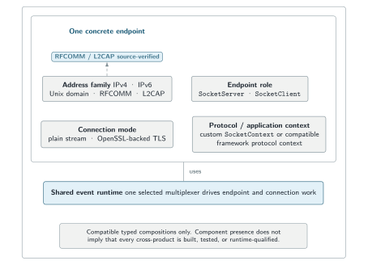
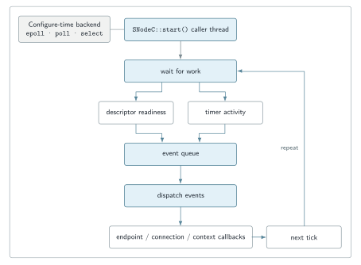
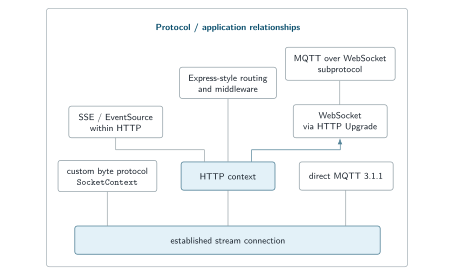

# Architecture and extension points

[← SNode.C](../README.md) · [Configuration](configuration.md) · [Capability map](capabilities.md) · [API reference](https://snodec.github.io/snode.c-doc/html/index.html)

SNode.C separates decisions that are commonly tangled together in a network application: when work is ready, which address family identifies a peer, whether an endpoint listens or connects, how the established stream is managed, and which protocol/application behavior is attached to it.

The result is a **typed composition model**, not an arbitrary “mix every layer with every other layer” system. A concrete application must still select compatible components and qualify the exact path it intends to deploy.

<picture>
  <source media="(max-width: 600px)" srcset="../assets/endpoint-composition-mobile.svg">
  
</picture>

Component presence is not a compatibility or qualification matrix; concrete compositions remain typed and evidence-scoped.

## 1. Event runtime

`core::SNodeC::start()` enters the framework event loop synchronously on the caller thread. At configure time one event-multiplexer backend is selected; current source contains `epoll`, `poll`, and `select` implementations. It is one selected backend, not three simultaneously active multiplexers.

A normal loop iteration waits for work, spans descriptor readiness into active events, executes the queued events, checks timed-out events, releases expired resources, and repeats while the loop is running. Descriptor and timer publishers feed the same event-dispatch path; callbacks are not handed to a framework worker pool.

<picture>
  <source media="(max-width: 600px)" srcset="../assets/event-loop-dispatch-mobile.svg">
  
</picture>

`start()` drives the loop on its caller thread; the figure does not imply a worker pool, fairness guarantee, or real-time scheduling.

This model keeps protocol code reactive, but it does not itself establish throughput, latency, fairness, or workload suitability. Those properties require measurements on the concrete build and traffic pattern.

Source anchors at the reviewed head [`1f0f728`](https://github.com/SNodeC/snode.c/commit/1f0f728fc9b3b45174f2cd790d83b2f493e58af1): [`SNodeC.cpp`](https://github.com/SNodeC/snode.c/blob/1f0f728fc9b3b45174f2cd790d83b2f493e58af1/src/core/SNodeC.cpp), [`EventLoop.cpp`](https://github.com/SNodeC/snode.c/blob/1f0f728fc9b3b45174f2cd790d83b2f493e58af1/src/core/EventLoop.cpp), and [`EventMultiplexer.cpp`](https://github.com/SNodeC/snode.c/blob/1f0f728fc9b3b45174f2cd790d83b2f493e58af1/src/core/EventMultiplexer.cpp).

## 2. Address family and endpoint role

Current source contains address/network families for IPv4, IPv6, Unix-domain, Bluetooth RFCOMM, and Bluetooth L2CAP. Stream clients and servers are then composed above the selected family:

- `SocketServer` owns listener setup and accepts connections;
- `SocketClient` owns connection attempts and client-side reconnect policy;
- a successful accept/connect path constructs a `SocketConnection`.

The role affects configuration. A server normally owns a local listener endpoint and learns remote addresses from accepted peers. A client normally requires a remote destination and may optionally bind a local endpoint. Server-specific accept/listen policy and client-specific reconnect policy therefore remain separate.

The source surface is broader than the recorded runtime qualification. IPv4, IPv6, and Unix-domain plain streams have recorded runtime evidence; RFCOMM and L2CAP remain source/build-visible paths requiring suitable hardware and their own runtime qualification.

## 3. Connection layer

`SocketConnection` owns the established connection mechanics shared by protocols: local and remote addresses, identity, reads and writes, output accounting, timeouts, shutdown, and the currently attached context.

Plain and OpenSSL-backed TLS variants provide different connection mechanics below the same application-context boundary. TLS is therefore a selected connection mode, not an automatic property of every server or client. Certificates, keys, trust anchors, verification policy, ciphers, timeouts, and SNI remain explicit deployment choices.

Current connection configuration exposes queue limits and high/low watermarks. Those mechanisms make queue state and policy visible; they should not be promoted into an unqualified claim that every application has automatic or sufficient backpressure behavior.

## 4. Factory and per-connection context

Each endpoint flow retains its own `SocketContextFactory`. When its `SocketConnection` becomes usable, the connection calls `SocketContextFactory::create(this)`. The returned non-null `SocketContext` is installed and attached as connection-local behavior.

The context owns protocol/application behavior, **not** the physical socket. It reads, sends, sets timeouts, and closes through its `SocketConnection`. That boundary is what lets the endpoint family or connection mode vary underneath a stable application-facing context model.

The [programming-model figure](../README.md#the-programming-model) shows server and client flows separately so it does not imply that both roles share a global factory or one connection object.

## 5. Context replacement and protocol upgrades

A `SocketConnection` can stage a replacement context while the current context is still active. After the current read dispatch returns, the old context detaches with `DetachReason::ContextSwitch`, the staged context becomes current, and the replacement attaches to the **same** established connection.

<picture>
  <source media="(max-width: 600px)" srcset="../assets/http-websocket-context-switch-mobile.svg">
  
</picture>

The old and replacement contexts are not simultaneously active; replacement is staged until the current HTTP read callback completes.

The HTTP server upgrade path is protocol-generic: an accepted `Connection: Upgrade` request is matched by its `Upgrade` header to a `SocketContextUpgradeFactory`. WebSocket is the concrete implementation shown here, not the conceptual limit of the replacement mechanism.

Source anchors: [`SocketConnection.cpp`](https://github.com/SNodeC/snode.c/blob/1f0f728fc9b3b45174f2cd790d83b2f493e58af1/src/core/socket/stream/SocketConnection.cpp), [`SocketConnection.hpp`](https://github.com/SNodeC/snode.c/blob/1f0f728fc9b3b45174f2cd790d83b2f493e58af1/src/core/socket/stream/SocketConnection.hpp), and [`SocketContextUpgradeFactory.h`](https://github.com/SNodeC/snode.c/blob/1f0f728fc9b3b45174f2cd790d83b2f493e58af1/src/web/http/SocketContextUpgradeFactory.h).

## 6. Higher protocol relationships

SNode.C supplies several higher-level protocol/application components, but they do **not** all occupy the same architectural role.

<picture>
  <source media="(max-width: 600px)" srcset="../assets/protocol-relationships-mobile.svg">
  
</picture>

Express, SSE, WebSocket, and MQTT are related by different semantics; the figure deliberately avoids presenting them as one flat stack.

- **Custom byte protocol:** implement a `SocketContext` directly over the stream connection.
- **HTTP:** provides request/response contexts.
- **Express-style routing/middleware:** application-facing API above the HTTP server context.
- **SSE/EventSource:** stays within HTTP and adds event-stream semantics; it does not use the context-replacement path.
- **WebSocket:** starts from HTTP Upgrade and replaces the HTTP context with framed bidirectional behavior.
- **MQTT 3.1.1:** has direct client/server protocol components and also composes through WebSocket as a subprotocol.

MQTTSuite owns the ready-made MQTT broker, integration, bridge, CLI, and storage application workflows; SNode.C owns the lower-level framework components they use.

## Extension checklist

Before adding a transport or protocol context, answer these questions:

1. Which object owns the connection, context, and application state?
2. What creates one context for each established connection?
3. Which events attach, deliver data, signal failure, and detach the context?
4. How are partial reads, queued writes, slow peers, and orderly shutdown handled?
5. Which settings belong to application-owned configuration, local/remote endpoint sections, connection/socket policy, or TLS?
6. Which concrete combinations are built and tested rather than merely expressible?
7. If dynamically loaded code is involved, who controls its path, compatibility, and deployment trust?

Continue with [Configuration](configuration.md) for operator-facing policy and inspection, or [Capabilities](capabilities.md) for source versus runtime evidence scope.
