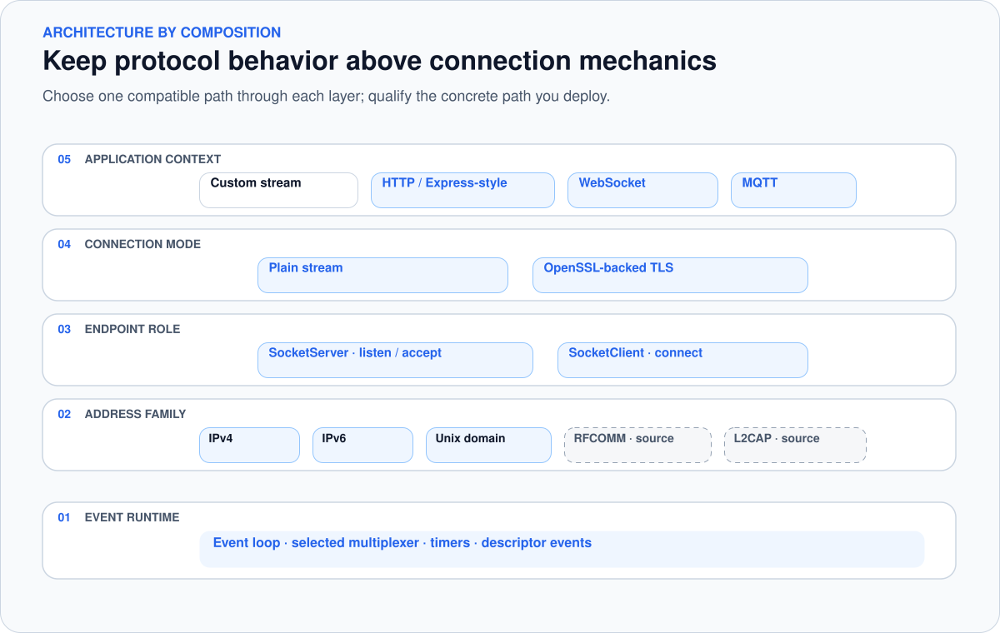
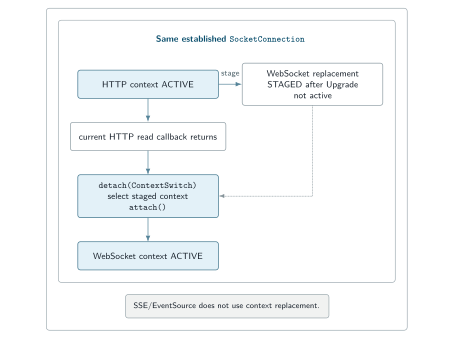

# Architecture and extension points

[← SNode.C](../README.md) · [Configuration](configuration.md) ·
[Capability map](capabilities.md) ·
[API reference](https://snodec.github.io/snode.c-doc/html/index.html)

SNode.C separates five decisions that are commonly tangled together in a
network application: when work is ready, which address family identifies a
peer, whether an endpoint listens or connects, how an established stream is
managed, and which protocol behavior is attached to that stream.

The result is not an arbitrary “mix every layer with every other layer” system.
It is a typed composition model with explicit extension points. A concrete
application still has to select compatible components, build them, and qualify
the path it intends to deploy.

<picture>
  <source media="(max-width: 600px)" srcset="../assets/layer-architecture-mobile.svg">
  
</picture>

<sub>The stack separates application behavior from endpoint and connection mechanics; highlighted qualification boundaries remain part of the documentation.</sub>

## 1. Event runtime

`core::SNodeC::start()` enters the framework event loop. The loop delegates
descriptor readiness and timer publication to an `EventMultiplexer`, queues the
resulting events, and dispatches them to their receivers. Current source
contains select, poll, and epoll multiplexer implementations.

This is the shared runtime underneath clients, servers, timers, and stream
connections. Application contexts react to events; they do not run their own
accept or polling loop. That keeps protocol code focused, but it does not by
itself establish performance, fairness, or workload suitability. Those require
measurements and tests for the concrete build and traffic pattern.

Source anchors:

- [`EventLoop`](https://github.com/SNodeC/snode.c/blob/60f26d9ae54b3e9ffde954d0ca75e53f79f31d79/src/core/EventLoop.h)
- [`EventMultiplexer`](https://github.com/SNodeC/snode.c/blob/60f26d9ae54b3e9ffde954d0ca75e53f79f31d79/src/core/EventMultiplexer.h)
- [multiplexer implementations](https://github.com/SNodeC/snode.c/tree/60f26d9ae54b3e9ffde954d0ca75e53f79f31d79/src/core/multiplexer)

## 2. Address family and endpoint role

Address-family layers provide the concrete socket and address types. Current
source trees exist for IPv4, IPv6, Unix-domain, Bluetooth RFCOMM, and Bluetooth
L2CAP communication. Stream clients and servers are then composed above the
selected family:

- a `SocketServer` owns listener setup and accepts connections;
- a `SocketClient` owns connection attempts and client-side reconnect policy;
- both create a `SocketConnection` after the underlying operation succeeds.

The role affects configuration. A server requires a local listener endpoint and
learns remote addresses from accepted peers. A client requires a remote
destination and may optionally bind a local endpoint. The framework reflects
those differences in its configuration sections rather than forcing both roles
through an undifferentiated address object.

Application-wide settings use the same configuration tree. `ConfigRoot` is a
`SubCommand`, and applications can attach their own typed `SubCommand` branches
alongside the framework-provided endpoint hierarchy; the
[configuration guide](configuration.md) covers that extension point.

The source tree is broader than the launch qualification. The published echo
evidence covers IPv4, IPv6, and Unix-domain plain streams plus mutual TLS over
IPv4. RFCOMM and L2CAP remain source-verified paths requiring suitable hardware
and their own runtime qualification.

## 3. Connection layer

`SocketConnection` owns the established connection and the mechanics shared by
protocols: local and remote addresses, connection identity, reads and writes,
queue accounting, timeouts, shutdown, and the currently attached context.

Plain stream and OpenSSL-backed TLS variants provide different connection
mechanics below the same application-context boundary. TLS is therefore a
selected and configured connection mode, not an automatic property of a server
or client. Certificates, keys, trust anchors, verification policy, ciphers,
timeouts, and SNI still need deliberate configuration.

The connection exposes both ordinary send operations and `trySendToPeer`
results. Current configuration also includes maximum queued bytes and high/low
watermarks. Those mechanisms make queue policy visible to applications, but
their existence should not be turned into an unqualified backpressure or
resource-bound guarantee. A deployed protocol still needs an explicit policy
for full queues, slow peers, and shutdown.

Source anchors:

- [`SocketConnection`](https://github.com/SNodeC/snode.c/blob/60f26d9ae54b3e9ffde954d0ca75e53f79f31d79/src/core/socket/stream/SocketConnection.h)
- [`SocketContext`](https://github.com/SNodeC/snode.c/blob/60f26d9ae54b3e9ffde954d0ca75e53f79f31d79/src/core/socket/stream/SocketContext.h)
- [`ConfigConnection`](https://github.com/SNodeC/snode.c/blob/60f26d9ae54b3e9ffde954d0ca75e53f79f31d79/src/net/config/ConfigConnection.h)

## 4. Factory and per-connection context

When a connection becomes usable, its `SocketContextFactory` creates the
application-facing `SocketContext`. The context is attached to exactly that
connection and receives lifecycle and data callbacks.

```text
configured client/server instance
              │
        accept or connect
              │
              ▼
       SocketConnection
              │
     SocketContextFactory
              │ creates
              ▼
        SocketContext
```

The echo application demonstrates the minimum useful implementation. Separate
server and client factories construct the same `EchoSocketContext` with a
different role. The client sends its initial greeting from `onConnected()`;
`onReceivedFromPeer()` reads and reflects data; `onDisconnected()` observes why
the context was detached.

The context owns protocol behavior, not the physical socket. It sends, reads,
sets timeouts, and closes through its `SocketConnection`. That boundary allows
the application model to remain stable while the endpoint family or connection
mode changes underneath it.

Source anchors:

- [`SocketContextFactory`](https://github.com/SNodeC/snode.c/blob/60f26d9ae54b3e9ffde954d0ca75e53f79f31d79/src/core/socket/stream/SocketContextFactory.h)
- [echo context and factories](https://github.com/SNodeC/snode.c/blob/60f26d9ae54b3e9ffde954d0ca75e53f79f31d79/src/apps/echo/model/EchoSocketContext.h)
- [echo callback implementation](https://github.com/SNodeC/snode.c/blob/60f26d9ae54b3e9ffde954d0ca75e53f79f31d79/src/apps/echo/model/EchoSocketContext.cpp)

## 5. Context replacement and protocol upgrades

A `SocketConnection` can replace its attached context. The previous context is
detached with `DetachReason::ContextSwitch`; the next context attaches to the
same established connection. HTTP-to-WebSocket upgrade is the clearest example.

<picture>
  <source media="(max-width: 600px)" srcset="../assets/http-websocket-context-switch-mobile.svg">
  
</picture>

<sub>The replacement is staged while HTTP remains active; the same established connection continues through the switch.</sub>

The server-side HTTP upgrade path is protocol-generic. An accepted
`Connection: Upgrade` request is matched through its `Upgrade` header to a
`SocketContextUpgradeFactory`, which creates the protocol-specific replacement
context. WebSocket is the concrete implementation shown here, not the only
possible upgrade target.

`setSocketContext(new)` stages the replacement while HTTP is still active, and
the protocol-specific factory prepares the switching response. After the current
HTTP read callback returns, the old context detaches with
`DetachReason::ContextSwitch`, the replacement attaches to the same established
`SocketConnection`, and no second transport connection is created. For
WebSocket, the replacement adds frame handling and optional subprotocol
selection.

Upgrade factories and WebSocket subprotocol factories can be linked into the
application; the current implementation also contains dynamic loading paths.
A loadable extension executes code inside the process, so packaging, search
paths, ownership, version compatibility, and allowed plugin names belong to the
deployment threat model rather than forming a security boundary.

Source anchors:

- [`SocketContextUpgradeFactory`](https://github.com/SNodeC/snode.c/blob/60f26d9ae54b3e9ffde954d0ca75e53f79f31d79/src/web/http/SocketContextUpgradeFactory.h)
- [server-side upgrade selection](https://github.com/SNodeC/snode.c/blob/60f26d9ae54b3e9ffde954d0ca75e53f79f31d79/src/web/http/server/Response.cpp)
- [WebSocket upgrade context](https://github.com/SNodeC/snode.c/blob/60f26d9ae54b3e9ffde954d0ca75e53f79f31d79/src/web/websocket/SocketContextUpgrade.h)

## 6. Higher protocol layers

SNode.C supplies source components above the stream layer:

- HTTP client and server contexts with request and response parsing;
- Express-style server routing and middleware above the HTTP server context;
- SSE/EventSource support for long-lived server-to-client event streams over
  HTTP, including event IDs and reconnection;
- WebSocket client/server upgrades and subprotocol infrastructure;
- MQTT 3.1.1 client/broker protocol components, including composition through
  WebSocket.

These layers do not all have the same role. Express-style routing is an
application-facing API above HTTP. SSE/EventSource remains within HTTP and adds
event-stream parsing and reconnection semantics; unlike WebSocket, it does not
replace the HTTP context through a protocol upgrade. WebSocket uses the upgrade
mechanism described above to attach a framed bidirectional protocol context.
MQTT supplies protocol framework components; MQTTSuite owns the ready-made
broker, integration, bridge, CLI, and storage application workflows.

Choose the highest layer that already owns the semantics the program needs. Use
the stream context for a custom byte protocol, HTTP for request/response
communication, SSE/EventSource for one-way server-to-client event streams,
WebSocket for framed bidirectional messages, and MQTT components for an MQTT
peer. Avoid wrapping a higher-level protocol in a second, competing lifecycle
abstraction.

## Extension checklist

Before adding a transport or protocol context, answer these questions:

1. Which object owns the connection, context, and application state?
2. What creates one context for each connection?
3. Which events attach, deliver data, signal failure, and detach the context?
4. How are partial reads, queued writes, slow peers, and orderly shutdown handled?
5. Which settings belong to an application-owned configuration subcommand, or
   to local, remote, connection, socket, or TLS endpoint sections?
6. Which combinations are built and tested rather than merely expressible?
7. If a plugin is loaded, who controls its path and compatibility?

For application and endpoint policy and inspection commands, continue with the
[configuration guide](configuration.md). For qualified versus source-only
scope, use the [capability map](capabilities.md).
