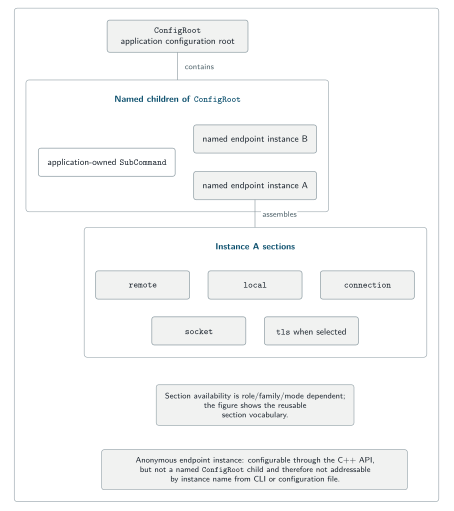
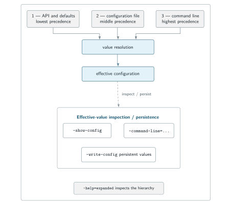
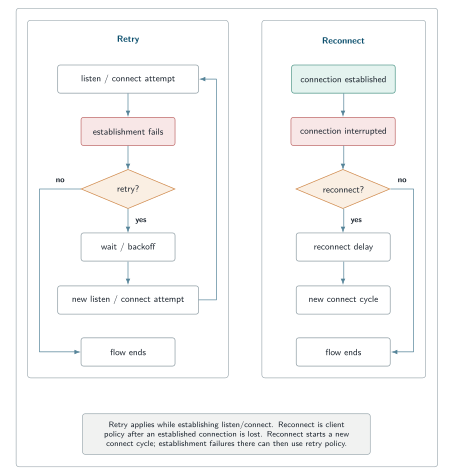

# Configuration without duplicated policy

[← SNode.C](../README.md) · [Architecture](architecture.md) · [Capability map](capabilities.md) · [API reference](https://snodec.github.io/snode.c-doc/html/index.html)

SNode.C applications use one typed configuration hierarchy for framework endpoint settings and application-owned policy. Named client/server instances become addressable branches of `ConfigRoot`; applications can attach their own `SubCommand` branches alongside them. Anonymous endpoint instances remain API-configurable but are not named CLI/config-file branches.

<p align="center">
<picture>
  <source media="(max-width: 600px)" srcset="../assets/configuration-hierarchy-mobile.svg">
  
</picture>
</p>

<sub>One root owns named application and endpoint branches; section availability depends on the concrete endpoint role, family, and connection mode.</sub>

## One application, several instances

An **instance** is one concrete client or server endpoint inside the process. A program can create several independently configured instances, for example an IPv4 listener plus a Unix-domain listener, or multiple outbound client connections.

Each **named** instance becomes its own command in the generated CLI and its own prefix in the configuration file. The instance name is therefore part of the operator-facing interface used by deployment commands, generated help, effective-state output, configuration files, and logs.

An **anonymous** instance is deliberately different: it can be configured through the C++ API but has no named root branch and therefore no instance-name address from the CLI or configuration file.

## Reusable endpoint sections

Concrete endpoint types assemble their configuration from reusable sections. The exact surface depends on endpoint role, address family, and connection mode.

| Section | Responsibility | Examples |
| --- | --- | --- |
| Instance | Participation and identity | instance name, disabled state |
| `local` | Local bind/listen side | host/port, Unix path, Bluetooth address/channel/PSM |
| `remote` | Peer selection | destination host/port or peer lookup policy |
| `connection` | Established-stream behavior | read/write timeouts, block sizes, queue limits/watermarks, terminate timeout |
| `socket` | Listen/connect mechanics | reuse, retry/backoff, backlog, accepts per tick, connect timeout, client reconnect |
| `tls` | OpenSSL-backed policy | certificate, key, CA, verification, ciphers, TLS options, SNI, init/shutdown timeouts |

A server normally requires a local listener. A client normally requires a remote destination and may optionally bind locally. Server accept/listen policy and client reconnect policy remain separate rather than being forced through one undifferentiated option set.

## Applications extend the same hierarchy

`ConfigRoot` is a `SubCommand`. Applications can derive their own `SubCommand` types and attach them with `newSubCommand<T>()` instead of introducing a second parser or configuration system:

```cpp
auto* appConfig =
    utils::Config::configRoot.newSubCommand<MyApplicationConfig>();
```

Application-owned options then participate in the same help, configuration-file, CLI, callback, and inspection machinery as endpoint configuration.

## Three configuration surfaces, one effective value

Values can enter the hierarchy through:

1. **C++ API/defaults** — initial state and the only configuration surface for anonymous instances;
2. **configuration file** — persistent values for named branches;
3. **command line** — per-invocation overrides.

The effective value resolves with the command line at the highest precedence.

<p align="center">
<picture>
  <source media="(max-width: 600px)" srcset="../assets/configuration-resolution-mobile.svg">
  
</picture>
</p>

<sub>Precedence is API/default &lt; configuration file &lt; command line; hierarchy inspection is distinct from effective-value inspection and persistence.</sub>

### C++ API

Each concrete endpoint exposes its assembled configuration through `getConfig()`:

```cpp
auto config = server.getConfig();

config->Local::setHost("127.0.0.1");
config->Local::setPort(18001);
config->Connection::setReadBlockSize(16 * 1024);
config->setReuseAddress();
```

### Configuration file

Named endpoint instances and application-owned subcommands can contribute persistent configuration. For an endpoint instance named `echo`, local values are addressed with qualified keys such as:

```ini
echo.local.host="127.0.0.1"
echo.local.port=18001
```

### Command line

The generated command hierarchy mirrors the ownership structure:

```sh
echoserver-legacy-in echoserver local --host 127.0.0.1 --port 18001
```

The executable is followed by the instance, then the section, then the section options. Public examples should therefore show the full hierarchy rather than presenting `--port` as a global switch.

## Inspect before running

The executable can expose both hierarchy and effective state:

```sh
# Full hierarchy including descendants.
echoserver-legacy-in --help=expanded

# Resolved effective configuration.
echoserver-legacy-in --show-config

# Complete generated command line.
echoserver-legacy-in --command-line=complete

# Non-default / required values.
echoserver-legacy-in --command-line=standard
```

`--write-config` persists configuration values to a configuration file; it should not be described as serializing arbitrary runtime state. Treat its output as a deployment artifact and review listener exposure, certificate/key paths, credentials, and permissive options before installing it.

## Retry and reconnect are different policies

Retry and reconnect solve different lifecycle failures.

<p align="center">
<picture>
  <source media="(max-width: 600px)" srcset="../assets/retry-vs-reconnect-mobile.svg">
  
</picture>
</p>

<sub>Retry applies during establishment; reconnect begins only after a client connection was established and later interrupted.</sub>

The physical-socket configuration exposes retry controls for failed listen/connect establishment, including attempt limits and backoff-related timing. Client configuration separately exposes reconnect behavior after an established connection is interrupted.

A reconnect therefore starts a **new client connect cycle**. If establishment of that new cycle fails, the ordinary retry policy may then govern those failed connect attempts. Reconnect is not a server policy and an initial connect failure is not itself a reconnect event.

## TLS remains role-specific

The common TLS section covers certificate/key material, CA sources, cipher/OpenSSL options, and initialization/shutdown timeouts. Servers add server-side certificate/SNI selection policy; clients add the server name they send and verification-related policy.

Configuration availability is not certificate management. A deployment still needs an explicit trust model, certificate issuance/rotation, protected private keys, hostname/SNI rules, and failure behavior.

## Deployment review

Before publishing endpoint or application configuration:

- confirm which local interfaces are exposed;
- confirm whether the selected endpoint is plain or TLS;
- review CA, certificate, key, SNI, and verification settings on both peers;
- set timeouts, retry, reconnect, and queue limits for the workload;
- inspect effective configuration from the exact installed executable;
- keep credentials and private keys out of command history and public logs;
- record the SNode.C revision and executable variant used.

Reviewed source anchors at [`1f0f728`](https://github.com/SNodeC/snode.c/commit/1f0f728fc9b3b45174f2cd790d83b2f493e58af1): [`Config.h`](https://github.com/SNodeC/snode.c/blob/1f0f728fc9b3b45174f2cd790d83b2f493e58af1/src/utils/Config.h), [`SubCommand.h`](https://github.com/SNodeC/snode.c/blob/1f0f728fc9b3b45174f2cd790d83b2f493e58af1/src/utils/SubCommand.h), [`ConfigInstance.cpp`](https://github.com/SNodeC/snode.c/blob/1f0f728fc9b3b45174f2cd790d83b2f493e58af1/src/net/config/ConfigInstance.cpp), [`ConfigPhysicalSocket.cpp`](https://github.com/SNodeC/snode.c/blob/1f0f728fc9b3b45174f2cd790d83b2f493e58af1/src/net/config/ConfigPhysicalSocket.cpp), and [`ConfigPhysicalSocketClient.cpp`](https://github.com/SNodeC/snode.c/blob/1f0f728fc9b3b45174f2cd790d83b2f493e58af1/src/net/config/ConfigPhysicalSocketClient.cpp).
