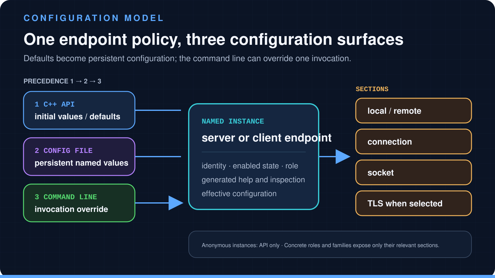

# Configuration without duplicated policy

[← SNode.C](../README.md) · [Architecture](architecture.md) ·
[Capability map](capabilities.md)

SNode.C applications can expose several client or server endpoints without
hard-coding deployment policy into their protocol callbacks. Each endpoint is
represented by an instance with a structured set of configuration sections.
The same values can be supplied through C++ setters, a configuration file, or
the generated command line.

<picture>
  <source media="(max-width: 600px)" srcset="../assets/configuration-model-mobile.svg">
  
</picture>

<sub>One instance hierarchy is addressed through three configuration surfaces; later sources override earlier defaults.</sub>

## One application, several instances

An **instance** is one concrete client or server endpoint inside the process. A
program can create more than one instance when it needs, for example, separate
IPv4 and Unix-domain listeners or independently configured client connections.
Each named instance becomes its own command in the generated CLI and its own
prefix in the configuration file.

Instance names must be stable and unambiguous within the application. They are
part of the operator-facing interface: deployment commands, generated help,
configuration files, effective-state output, and logs use them to identify the
endpoint being controlled.

Anonymous instances are intentionally different. They can be configured in
code, but they do not expose a named command-line/config-file address. Use them
for a genuinely fixed internal endpoint, not to avoid designing a public
configuration contract.

## The section hierarchy

Concrete endpoint types assemble their configuration from reusable sections.
The exact surface depends on role, address family, and connection mode.

| Section | Responsibility | Typical examples |
| --- | --- | --- |
| Instance | Whether this endpoint participates and how it is identified | instance name, disabled state |
| `local` | Local bind/listen side | host and port, Unix path, Bluetooth address/channel/PSM |
| `remote` | Peer selection or reverse-address behavior | destination host and port, peer lookup policy |
| `connection` | Established-stream behavior | read/write timeouts, block sizes, queue limits and watermarks, terminate timeout |
| `socket` | Listen/connect mechanics | address reuse, retry/backoff, backlog, accepts per tick, connect timeout, client reconnect |
| `tls` | OpenSSL-backed connection policy | certificate, key, CA sources, verification, ciphers, TLS options, initialization/shutdown timeouts, SNI |

A server normally requires its local listener address. A client normally
requires its remote destination and may optionally configure a local bind
address. Server-only and client-only options remain separate: backlog and
accept policy do not belong to a client, while reconnect policy does not belong
to an accepted server connection.

## Three configuration surfaces

### C++ API

Every concrete client or server exposes its assembled configuration through
`getConfig()`. Scope-qualified setters make the side of the connection clear
when names would otherwise be ambiguous:

```cpp
auto config = server.getConfig();

config->Local::setHost("127.0.0.1");
config->Local::setPort(18001);
config->Connection::setReadBlockSize(16 * 1024);
config->setReuseAddress();
```

API values are useful defaults and are the only configuration surface for an
anonymous instance. Avoid embedding deployment-specific certificates,
credentials, external addresses, or machine paths in those defaults.

### Configuration file

Named instances can load persistent values from the application configuration
file. The hierarchy is flattened into qualified keys, keeping the instance and
section visible. For an instance named `echo`, a local port is represented as:

```ini
echo.local.port=18001
```

Use configuration files for reviewed deployment policy that should be
repeatable across restarts. Protect files containing key paths, key passwords,
credentials, or remote-service details according to the operating environment.

### Command line

The generated command hierarchy follows the same shape:

```sh
echoserver-legacy-in echo local --host 127.0.0.1 --port 18001
```

The executable is followed by the instance, then the section, then its options.
Application-wide options remain at the application level. This is why a public
quick start should show the full hierarchy instead of presenting `--port` as an
unscoped global switch.

## Precedence

The effective value is resolved in this order:

1. values established through the API provide the initial/default state;
2. configuration-file values override those defaults;
3. command-line values override the loaded configuration for that invocation.

That makes a command-line override useful for diagnosis without forcing an
operator to edit the persistent file. It also means the command that happened
to launch a process is not necessarily the whole configuration: defaults and
file values may still be active.

## Inspect before running

SNode.C exposes the effective configuration and the generated command surface
directly from the executable:

```sh
# Full hierarchy with descendant sections.
echoserver-legacy-in --help=expanded

# Resolved configuration.
echoserver-legacy-in --show-config

# Complete command line including defaults.
echoserver-legacy-in --command-line=complete

# Only non-default and required values.
echoserver-legacy-in --command-line=standard
```

The application can also write its current persistent configuration through
`--write-config`. Treat the resulting file as a review artifact: inspect paths,
credentials, certificates, listener exposure, and permissive options before
installing it as deployment state.

## Retry and reconnect are different policies

The physical-socket configuration contains retry controls for listen/connect
operations, including attempt count, timeout, exponential base, jitter, and an
upper time limit. Client configuration separately exposes reconnect behavior
after an established connection is interrupted.

Those policies solve different failures. A connection attempt that cannot be
established is not the same lifecycle state as a connection that was established
and later lost. Set bounded behavior deliberately, and make application handling
of prolonged outage and full write queues explicit.

## TLS remains role-specific

The common TLS section covers certificate/key material, CA sources, cipher and
OpenSSL options, and initialization/shutdown timeouts. Servers add certificate
selection for SNI and can require SNI. Clients add the server name they send.

Configuration availability is not a certificate-management system. The
application still needs a reviewed trust model, certificate issuance and
rotation, protected private keys, hostname/SNI rules, and failure behavior. A
local example that connects with a test CA is evidence for that test path only.

## Deployment review

Before publishing an instance configuration:

- confirm which local interfaces are exposed;
- confirm whether the selected variant is plain or TLS;
- review CA, certificate, key, SNI, and verification settings on both peers;
- set timeouts, retry, reconnect, and queue limits for the workload;
- inspect the effective configuration from the exact installed executable;
- keep credentials and private keys out of command history and public logs;
- record the SNode.C revision and concrete executable variant used.

Source anchors for the reviewed baseline:

- [`ConfigInstance`](https://github.com/SNodeC/snode.c/blob/bf01683a53b48220a840522e8ccaf3b48e58c240/src/net/config/ConfigInstance.h)
- [`ConfigConnection`](https://github.com/SNodeC/snode.c/blob/bf01683a53b48220a840522e8ccaf3b48e58c240/src/net/config/ConfigConnection.h)
- [`ConfigPhysicalSocket`](https://github.com/SNodeC/snode.c/blob/bf01683a53b48220a840522e8ccaf3b48e58c240/src/net/config/ConfigPhysicalSocket.h)
- [`ConfigTls`](https://github.com/SNodeC/snode.c/blob/bf01683a53b48220a840522e8ccaf3b48e58c240/src/net/config/ConfigTls.h)
- [generated application configuration](https://github.com/SNodeC/snode.c/blob/bf01683a53b48220a840522e8ccaf3b48e58c240/src/utils/Config.cpp)

For how these settings become live connection and context objects, return to
the [architecture guide](architecture.md).
